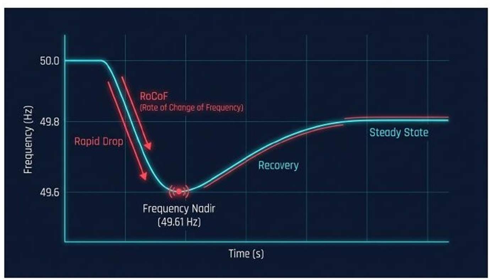
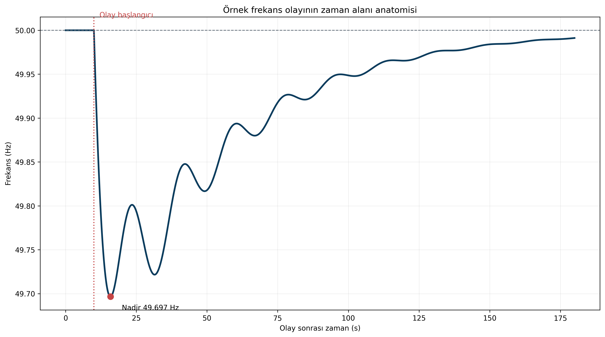
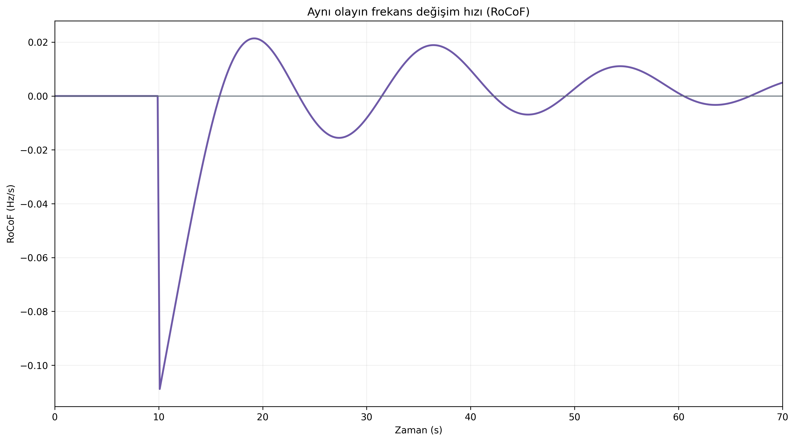
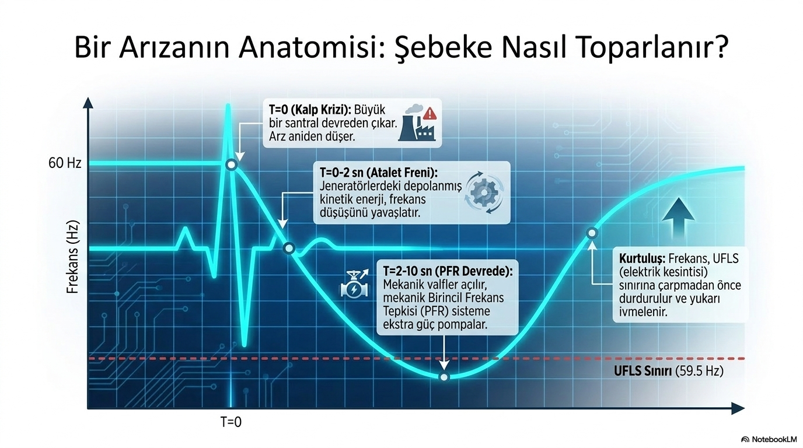

# Bir Frekans Olayının Anatomisi

**Alt başlık:** RoCoF, frekans nadiri, toparlanma ve kontrol rezervlerini bir olay eğrisi üzerinden okumak

Büyük bir üretim kaybı sonrasında frekans eğrisinin neden önce hızla düştüğünü, en düşük noktaya nasıl ulaştığını ve hangi kontrol katmanlarıyla toparlandığını formül yüküne boğmadan açıklar.

> **Ana mesaj:** Tek bir sayı yerine olayın zaman çizgisini okuyun: RoCoF ilk savunmayı, nadir güvenlik marjını, toparlanma ise rezerv koordinasyonunu anlatır.

## Frekans neden değişir?

Elektrik şebekesinde aktif güç üretimi ile tüketim her an birbirine çok yakın olmak zorundadır. Büyük bir üretim ünitesi devreden çıktığında denge bozulur ve senkron jeneratörlerin rotorlarında depolanan kinetik enerji açığı kısa süreliğine karşılamaya başlar. Rotorların yavaşlaması, sistem frekansının düşmesi olarak gözlenir.

Bu ilk tepkiye inertia response (atalet yanıtı) denir. Atalet bir kum torbası gibi arızayı ortadan kaldırmaz; yalnızca frekansın ne kadar hızlı değişeceğini sınırlar. Bu nedenle aynı MW büyüklüğündeki iki üretim kaybı, farklı atalet koşullarında çok farklı frekans eğrileri oluşturabilir.

## Bir olay eğrisindeki dört kritik bölge

İlk saniyelerde Rate of Change of Frequency - RoCoF (frekans değişim hızı) izlenir. RoCoF ne kadar büyükse frekans o kadar hızlı uzaklaşıyor demektir. Ardından frequency nadir (frekansın en düşük noktası) gelir. Nadir, sistemin koruma eşiklerine ne kadar yaklaştığını gösteren en görünür sonuçtur.

Nadir sonrasında Primary Frequency Control / FCR (primer frekans kontrolü / frekans tutma rezervi) devreye girerek düşüşü durdurur. Sonraki aşamada Frequency Restoration Reserve - FRR (frekans restorasyon rezervi) ve Otomatik Üretim Kontrolü - AGC (otomatik üretim kontrolü) frekansı nominal değere yaklaştırır ve ilk rezerv katmanını yeniden kullanılabilir hâle getirir.

## RoCoF bize ne söyler?

RoCoF tek başına “sistemde şu kadar atalet vardır” demek için yeterli değildir; olay büyüklüğü, ölçüm penceresi, filtreleme ve yüklerin frekans duyarlılığı da sonucu etkiler. Yine de olayın ilk kısmında, bilinen bir güç kaybı ile birlikte kullanıldığında sistem ataleti hakkında güçlü bir gösterge sağlar.

Basit ilişki şöyledir: RoCoF yaklaşık olarak güç dengesizliği ile doğru, toplam kinetik enerji ile ters orantılıdır. Başka bir ifadeyle aynı 1 GW kayıp, daha düşük ataletli bir sistemde daha yüksek Hz/s değişimi üretir.

## Olay analizi yaparken kaçırılmaması gerekenler

Başlangıç frekansı, nadir, nadire ulaşma süresi, maksimum RoCoF, geçici denge frekansı ve toparlanma süresi birlikte değerlendirilmelidir. Yalnızca minimum frekansın raporlanması, kontrolün neden başarılı veya yetersiz olduğuna dair çok az bilgi verir.

Bir olay eğrisi, belirli bir sistemin ve belirli bir işletme anının fotoğrafıdır. Bu nedenle örnek bir eğriyi, aynı büyüklükteki her üretim kaybında tekrarlanacak evrensel bir şablon olarak değil; metrikler arasındaki fiziksel ilişkiyi açıklayan bir çalışma örneği olarak okumak gerekir.

## İlk saniyelerin dinamiği: atalet, RoCoF ve aktif güç tepkisi

Güç dengesizliği oluştuğu anda senkron makinelerde depolanan kinetik enerji frekans değişim hızını sınırlar. Bu doğal yanıt, üretim açığını kapatan yeni bir aktif güç kaynağı değildir. **Atalet frekansı 50 Hz’e geri getirmez; esas olarak ilk RoCoF’u sınırlar ve denetim katmanlarının çalışması için zaman yaratır.**

Aktif güç tepkisinin başlangıcı ve rampası ise sabit zaman dilimlerine ayrılmaz. Governor dinamiği, türbin tipi, ölçüm filtresi, inverter denetimi, hizmet yükümlülüğü ve kullanılabilir rezerv her tesiste farklıdır. PFK/FCR, frekans sapmasına karşı aktif güç değiştirerek düşüşün büyümesini durdurmaya yardım eder. Daha sonraki restorasyon katmanları ise frekansı ve kontrol alanı dengesini nominal koşullara taşır. Bu nedenle birkaç saniyelik bir pencere önemlidir; ancak “ilk iki saniye yalnızca atalet, sonraki sekiz saniye yalnızca kontrol” biçiminde yorumlanmamalıdır.

## Olay öncesinden restorasyona kadar hangi büyüklükler izlenir?

Sağlıklı bir olay değerlendirmesi, arıza anından önceki işletme noktasını da kapsar. Başlangıç frekansı nominalden zaten uzaksa, aynı güç kaybı daha dar bir güvenlik marjında başlar. Devredeki rezervin miktarı kadar, bu rezervin hangi yönde ve ne hızda kullanılabildiği de belirleyicidir. Bir ünitenin ayrılmasıyla oluşan net aktif güç açığı; eşzamanlı yük değişimleri, enterkonneksiyon akışları ve frekansa duyarlı yüklerin davranışıyla birlikte değerlendirilmelidir.

İlk RoCoF, olayın başlangıçtaki şiddetini gösterir. Değer hesaplanırken kullanılan zaman penceresi, örnekleme aralığı ve filtreleme açıkça belirtilmelidir; aksi hâlde farklı hesaplar karşılaştırılamaz. Frekans nadiri, kontrol ve doğal sönümleme toplamının açığı ne zaman dengelediğini gösterir. Nadire ulaşma süresi, kontrolün olayın hangi aşamasında etkili olmaya başladığına ilişkin ek bağlam sağlar; tek başına bir performans puanı değildir.

Nadirden sonra eğri sıklıkla **quasi-steady-state frequency (geçici kararlı durum frekansı)** olarak adlandırılan yeni bir platoya yaklaşır. Bu plato nominal frekanstan farklı olabilir. Primer kontrolün görevi bu noktada sistemi kararlı tutmaktır; nominale dönüş, frekans restorasyon rezervi ve AGC ile ilişkili daha yavaş kapalı çevrim denetiminin işidir. Restorasyon tamamlandığında ilk rezerv katmanının yeniden boşaltılması ve olayda kullanılan enerji ya da üretim marjının yenilenmesi gerekir. Aksi durumda sistem aynı gün içindeki ikinci bir bozuntuya daha kırılgan girer.

## Aynı MW kayıp neden her gün aynı frekans olayını oluşturmaz?

Bir üretim kaybının MW değeri tek başına sonuç tahmini için yeterli değildir. Öncelikle toplam senkron kinetik enerji değişir: çevrim içi makinelerin sayısı, gücü ve çalışma noktası aynı değildir. Üretim kompozisyonu, senkron kompansatörlerin devrede olup olmaması ve inverter tabanlı kaynakların seçilmiş denetim işlevleri ilk eğimi etkileyebilir. Yük sönümlemesi de önemlidir; frekans düştükçe bazı yüklerin doğal olarak daha az güç çekmesi, net açığın bir bölümünü azaltabilir.

Başlangıç frekansı, kullanılabilir yukarı yönlü rezerv, rezervin aktivasyon hızı ve denetim sistemlerinin doygunlukları nadiri değiştirir. İletim topolojisi ile ada oluşumu riski de yerel güç dengesizliklerinin hangi bölgelerde yoğunlaşacağını belirler. Bu etkenler, aynı büyüklükte iki kaybın farklı RoCoF, farklı nadir ve farklı toparlanma süresi üretmesini açıklar. Olay analizi, MW kaybını tek başına neden olarak sunmak yerine bu işletme bağlamını görünür kılmalıdır.

## GridFreq ile olay eğrisini ihtiyatla okumak

GridFreq; başlangıç seviyesi, RoCoF adayı, minimum/maksimum değer, nadir ve toparlanma biçimini aynı zaman ekseninde incelemeye yardımcı olur. Bu görünüm aday olayları ayırmak, farklı günleri karşılaştırmak ve ayrıntılı işletme kaydı istenecek zaman aralıklarını belirlemek için yararlıdır. Ancak yalnızca frekans serisinden arızanın yeri, açılan ekipman ya da kesin kök neden çıkarılamaz. Bu değerlendirme için üretim, kesici, güç akışı ve koruma kayıtları gerekir.

Mühendislik açısından en değerli sonuç, tek bir minimum frekans sayısı değil; güç dengesizliği, ilk eğim, nadir, geçici kararlı durum ve rezerv yenileme arasındaki tutarlı hikâyedir. Bu hikâye, hem koruma marjlarını hem de sonraki olay için hazır bulundurulması gereken kontrol kapasitesini birlikte gösterir.

## Olay metriklerini aynı bağlamda tutmak

RoCoF, nadir ve toparlanma birbirinin yerine geçecek göstergeler değildir. Yüksek RoCoF her zaman en düşük nadiri, derin nadir de her zaman en yavaş restorasyonu üretmez. İlk metrik atalet ve ilk açık hakkında; nadir, kontrol ile yük sönümlemesinin zamanında toplam etkisi hakkında; toparlanma ise rezerv koordinasyonu hakkında bilgi taşır. Bu ayrımı korumak, bir olayın tek bir grafiğe ya da tek bir performans eşiğine indirgenmesini önler.

Koruma eşiklerine yakın olaylarda zaman çözünürlüğü ayrıca önem kazanır. Saniyelik kayıt, olayın makro biçimini karşılaştırmak için yararlı olabilir; çok hızlı koruma veya elektromekanik geçişlerin kesin zamanlaması için daha yüksek çözünürlüklü saha kaydı gerekir. Analiz sonucu bu veri sınırıyla birlikte raporlandığında, olay eğrisi hem karar desteği hem de daha ayrıntılı inceleme için güvenilir bir başlangıç olur.
