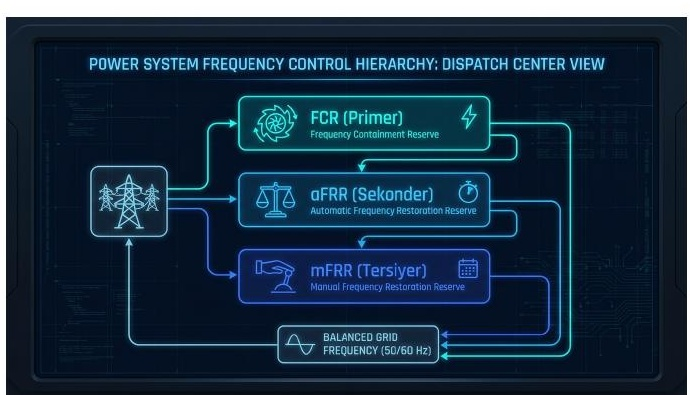
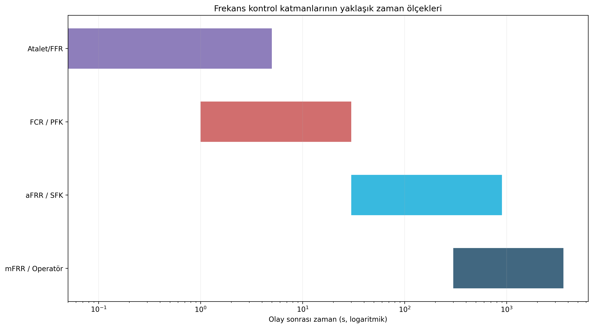
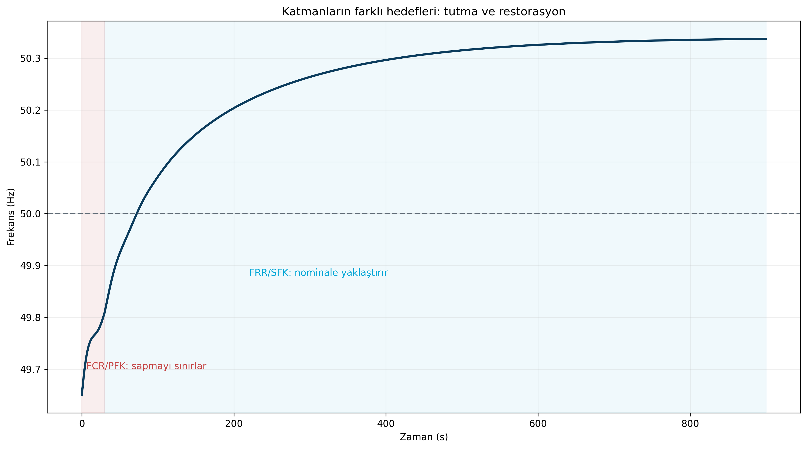
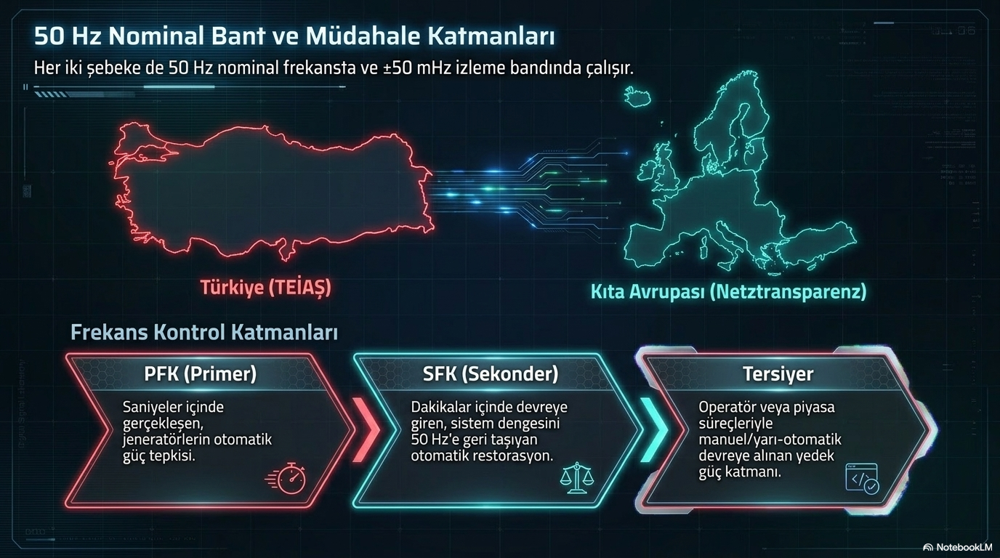

# Frekans Kontrolünün Üç Savunma Hattı

**Alt başlık:** PFK/FCR, SFK/aFRR ve mFRR hangi sırayla, hangi amaçla çalışır?

Primer, sekonder ve manuel frekans rezervlerinin birbirinin alternatifi değil, farklı zaman ölçeklerinde çalışan tamamlayıcı katmanlar olduğunu açıklar.

> **Ana mesaj:** Kontrol katmanlarını “kim daha hızlı?” sorusuyla değil, “hangi problemi hangi zaman ölçeğinde çözüyor?” sorusuyla okuyun.

## Neden tek bir kontrol katmanı yetmez?

Bir şebeke arızası milisaniyeler içinde başlar fakat ekonomik ve güvenli yeni işletme noktasına dönmek dakikalar alabilir. Bu nedenle frekans kontrolü tek bir regülatöre bırakılmaz. Kontrol mimarisi, en hızlı fiziksel tepkiden operatör ve piyasa kararlarına kadar katmanlara ayrılır.

İlk katman olayı tutar, ikinci katman frekansı ve bölgesel dengeyi geri getirir, üçüncü katman ise kullanılan rezervleri yeniler ve sistemin bir sonraki arızaya hazır olmasını sağlar.

## PFK / FCR: düşüşü durdurma katmanı

Primary Frequency Control - PFK/FCR (primer frekans kontrolü / frekans tutma rezervi) yerel ve otomatik çalışır. Jeneratör hız regülatörü veya uygun bir güç elektroniği kontrolörü frekans sapmasını algılar ve aktif güç çıkışını değiştirir.

PFK’nın temel hedefi 50.00 Hz’e dönmek değildir. Asıl görev frekansın daha fazla uzaklaşmasını engellemek ve sistemi yeni bir geçici denge noktasında tutmaktır. Bu ayrım önemlidir; primer kontrolün “başarılı” olduğu bir olayın sonunda frekans hâlâ nominalden farklı olabilir.

## SFK / aFRR: nominale dönüş ve bölgesel denge

Automatic Frequency Restoration Reserve - aFRR (otomatik frekans restorasyon rezervi), Türkiye terminolojisinde Sekonder Frekans Kontrolü - SFK ile ilişkilidir. Merkezi AGC (otomatik üretim kontrolü) sistemi, frekans ve enterkonneksiyon program sapmalarını değerlendirerek katılımcı ünitelere yeni aktif güç hedefleri gönderir.

Bu katman primer rezervi serbest bırakır. Böylece FCR sürekli dolu tutulan bir “ilk yardım çantası” gibi bir sonraki büyük bozuntu için yeniden hazır hâle gelir.

## mFRR ve işletme optimizasyonu

Manually Activated Frequency Restoration Reserve - mFRR (manuel etkinleştirilen frekans restorasyon rezervi) daha uzun zaman ölçeğinde devreye alınır. Amaç, otomatik rezervleri değiştirmek, sistem yedeklerini yeniden dağıtmak ve işletmeyi güvenlik kısıtları altında daha ekonomik bir noktaya taşımaktır.

Avrupa terminolojisinde FCR, aFRR, mFRR ve gerektiğinde Replacement Reserve - RR (yerine koyma rezervi) birbiriyle tanımlı bir süreç içinde çalışır. Terminoloji ülkeden ülkeye değişebileceği için “primer-sekonder-tersiyer” ifadelerini modern Avrupa rezerv adlarıyla birebir eşitlemek yerine işlev ve zaman ölçeği üzerinden karşılaştırmak daha güvenlidir.

## FFR ve yeni nesil katmanlar

Fast Frequency Response - FFR (hızlı frekans tepkisi), düşük ataletli sistemlerde klasik regülatör tepkisinden daha erken devreye girebilen güç elektroniği tabanlı bir destektir. Bataryalar, HVDC bağlantıları ve grid-forming inverter (şebeke oluşturan evirici) kontrol stratejileri bu alanda öne çıkar.

TEİAŞ’ın Temmuz 2026 tarihli depolama teknik kriterleri ayrıca “hızlı frekans kontrol hizmeti” ile “atalet destek hizmeti” kavramlarını tanımlamıştır. Bu durum Türkiye’de depolamanın frekans güvenliğindeki rolünün yalnızca klasik PFK ile sınırlı kalmadığını gösterir.

## PowerPoint içeriğiyle genişletilmiş okuma: 50 Hz nominal bant ve müdahale katmanları

Sunumlar, frekans kontrol katmanlarını 50 Hz nominal referansı etrafında görsel olarak ayırıyor: PFK/FCR saniyeler içinde çalışan ilk savunma, SFK/aFRR dakikalar içinde devreye giren restorasyon katmanı ve tersiyer/mFRR daha uzun ölçekte sistemi yeniden düzenleyen işletme katmanı. Bu görsel ayrım, farklı rezervlerin aynı işi yapmadığını açık biçimde gösterir.

Türkiye ve Kıta Avrupası örnekleri yan yana konduğunda terminolojinin farklı, işlevin ise büyük ölçüde benzer olduğu görülür. Bu nedenle sistemleri karşılaştırırken kısaltmalara değil, **tepki süresi**, **kontrol amacı** ve **rezervin serbest bırakma işlevine** bakmak en doğru yöntemdir.

## Okuyucu için pratik ayrım

Birincil katman “frekansı tutar”, ikincil katman “frekansı nominale geri yaklaştırır”, üçüncül katman ise “rezervleri yeniler ve sistemi bir sonraki olaya hazırlar”. Sunumdaki görsel akış bu mantığı yalınlaştırdığı için, makalenin eğitim değeri de artmaktadır.

## Kaynaklar ve editoryal not

Bu metin, kullanıcı tarafından sağlanan GridFreq teknik dokümanları temel alınarak hazırlanmıştır. Simülasyon sonuçları model/senaryo bağımlı olarak ifade edilmiştir; mevzuatla ilgili kritik noktalar güncel TEİAŞ/ENTSO-E kaynaklarıyla karşılaştırılmıştır.

- Ekli kaynak: `gridfreq-control-layers-report.pdf`

- Ekli kaynak: `gridfreq-technical-manual.pdf`

- Dış doğrulama: TEİAŞ 03.07.2026 depolama teknik kriterleri ve test prosedürleri.

- Dış doğrulama: ENTSO-E/Fingrid sistem işletme ve frekans kalite yayınları.

> GridFreq bağımsız bir analiz platformudur; metin resmî sistem işletmecisi görüşü değildir.
