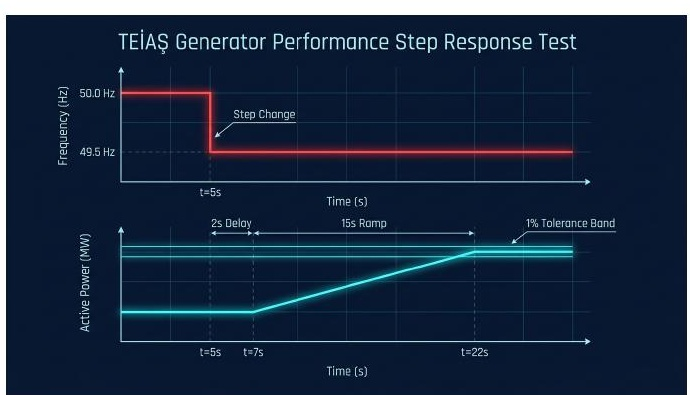
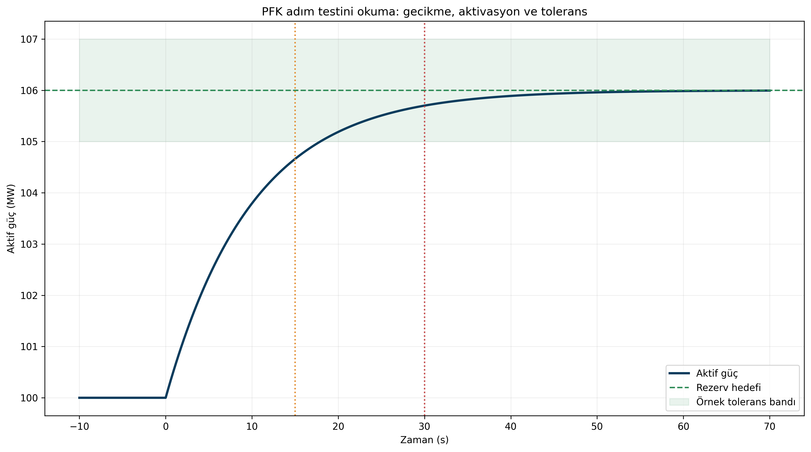
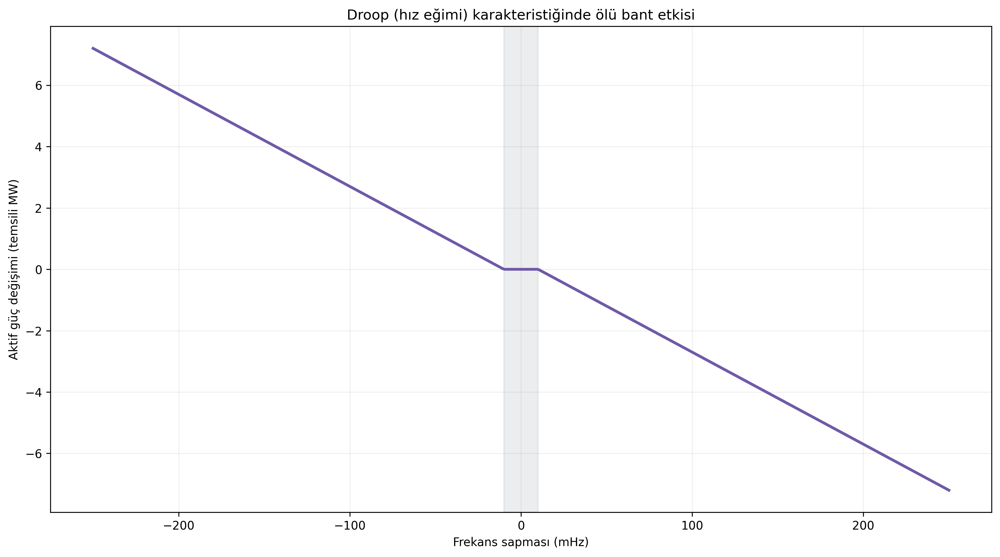

# TEİAŞ PFK Performans Testini Okuma Rehberi

**Alt başlık:** Rezerv, hassasiyet ve doğrulama testlerinde ölçülen şey aslında nedir?

PFK performans testlerinin mantığını, test verisinin nasıl okunacağını ve yanlış yorumlanan tolerans/tepki kavramlarını sade bir mühendislik diliyle anlatır.

> **Ana mesaj:** PFK testinde “hedef güce ulaştı” demek yeterli değildir; gecikme, yükselme hızı, tolerans ve sürdürülebilirlik aynı zaman çizgisinde birlikte okunmalıdır.

## Testin amacı sertifika almaktan daha fazlasıdır

Primer Frekans Kontrolü - PFK (primary frequency control / primer frekans kontrolü) performans testi, bir üretim veya depolama biriminin frekans sapması karşısında beklenen aktif güç tepkisini gerçekten üretip üretemediğini doğrular. Test yalnızca “güç arttı mı?” sorusunu değil; ne kadar gecikmeyle başladığını, hedefe ne hızla ulaştığını ve tepkiyi ne kadar kararlı sürdürebildiğini de inceler.

Bu nedenle iyi bir test raporu; frekans sinyali, aktif güç, güç referansı ve kontrol sistemine ait ilgili yardımcı sinyalleri aynı zaman ekseninde göstermelidir.

## Rezerv testi: adım sinyalinden dinamik cevaba

Ekli PFK raporu, -200 mHz ve +200 mHz simüle frekans basamaklarıyla yük alma ve yük atma yönlerinin sınandığı klasik yaklaşımı açıklar. Bu testte ilk bakılan gösterge response delay (tepki gecikmesi), ardından partial/full activation (kısmi/tam etkinleştirme) ve sustainment (sürdürülebilirlik) davranışıdır.

TEİAŞ’ın 03.07.2026 tarihli depolama prosedürü PFK için 200 mHz sapmada rezervin %50’sinin en geç 15 s, tamamının en geç 30 s içinde etkinleşmesini; depolama için tepki gecikmesinin 2 s’yi aşmamasını ve çıkışın en az 15 dakika sürdürülebilmesini şart koşar. Konvansiyonel ünitelerde güncel Ek-17 metni ve TEİAŞ test formatı esas alınmalıdır.

## Hassasiyet ve ölü bant

Deadband (ölü bant), kontrolörün nominal frekans çevresindeki çok küçük sapmalara bilinçli olarak tepki vermediği aralıktır. Hassasiyet testinin amacı küçük frekans değişimlerinin ölçüm ve kontrol zinciri tarafından görülüp görülmediğini anlamaktır.

Ölü bant çok geniş olduğunda ünite küçük ama uzun süreli frekans sapmalarına geç tepki verir. Çok dar veya sıfır ölü bant ise mekanik ekipmanlarda gereksiz hareket ve kontrol gürültüsünü artırabilir. Bu nedenle test ayarı ile işletme ayarının aynı kavram olmadığı özellikle belirtilmelidir.

## Tolerans bandını yanlış okumamak

Tolerans bandı, tek bir örneğin hedef çizgiden ne kadar saptığından çok, cevabın kabul edilen dinamik zarf içinde ne kadar süre kaldığını değerlendirmek için kullanılır. Kaynak dokümanlarda ±%1 kurulu güç gibi ifadeler yer almakla birlikte, güncel hizmet türüne ve tesis tipine göre tolerans tanımı değişebilir.

Örneğin TEİAŞ’ın 2026 depolama prosedüründe 10 mHz üzerindeki PFK sapmalarında tolerans, frekansın yönüne göre rezerv yükümlülüğünün +%20/-10 veya -%20/+10 sınırlarıyla asimetrik biçimde tanımlanmıştır. Bu nedenle web makalesi sabit bir toleransı “tüm PFK testlerinin evrensel kuralı” gibi sunmamalıdır.

## Kayıt ve veri kalitesi

Test sonucunun güvenilirliği yalnızca santralin performansına değil, ölçüm zincirinin zaman eşlemesine, örnekleme hızına, kalibrasyonuna ve sinyal ölçeklendirmesine de bağlıdır. Milisaniye mertebesindeki zaman kaymaları, özellikle tepki başlangıcı ve hızlı kaynaklarda önemli değerlendirme hataları yaratabilir.

GridFreq gibi bir analiz katmanı için önerilen yaklaşım, ham veriyi saklamak; türetilmiş sonuçları (gecikme, rezerv yüzdesi, tolerans içinde kalma süresi) yeniden hesaplanabilir metrikler olarak üretmektir.

## PowerPoint içeriğiyle genişletilmiş okuma: veri tedarik zinciri ve bağımsız ölçüm mantığı

PowerPoint materyalleri, frekans verisinin kurum kaynaklarından nasıl çekildiğini, doğrulandığını ve ortak zaman eksenine nasıl yerleştirildiğini anlatıyor. PFK testlerini okurken benzer bir veri disiplini gerekir: zaman damgaları tutarlı olmalı, ölçüm çözünürlüğü korunmalı ve kullanılan cihazlar santral iç kayıtlarından bağımsız olmalıdır.

Bu vurgu, TEİAŞ’ın harici test teçhizatı istemesinin nedenini de daha görünür kılar. Amaç yalnızca bir form doldurmak değil; tepki gecikmesi, %50 ve %100 aktivasyon süresi ile sürdürülebilirlik gibi kriterleri **tekrar üretilebilir** bir veri kaydı üzerinden değerlendirmektir.

## Test raporunu daha doğru okumak için

Bir test grafiğinde beklenen eğri ile fiilî eğri arasındaki farkı yorumlarken sadece sonuca değil, örnekleme hızına, frekans simülasyonunun düzgün uygulanıp uygulanmadığına ve veri boşluklarına da bakılmalıdır. Sunumların veri zinciri vurgusu, makaledeki saha okumasını bu nedenle güçlendirir.

## Kaynaklar ve editoryal not

Bu metin, kullanıcı tarafından sağlanan GridFreq teknik dokümanları temel alınarak hazırlanmıştır. Simülasyon sonuçları model/senaryo bağımlı olarak ifade edilmiştir; mevzuatla ilgili kritik noktalar güncel TEİAŞ/ENTSO-E kaynaklarıyla karşılaştırılmıştır.

- Ekli kaynak: `gridfreq-pfk-tests-report.pdf`

- Ekli kaynak: `gridfreq-technical-manual.pdf`

- Dış doğrulama: TEİAŞ 03.07.2026 depolama teknik kriterleri ve test prosedürleri.

> GridFreq bağımsız bir analiz platformudur; metin resmî sistem işletmecisi görüşü değildir.
