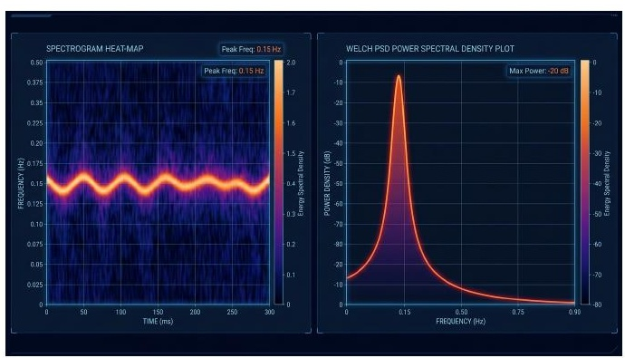
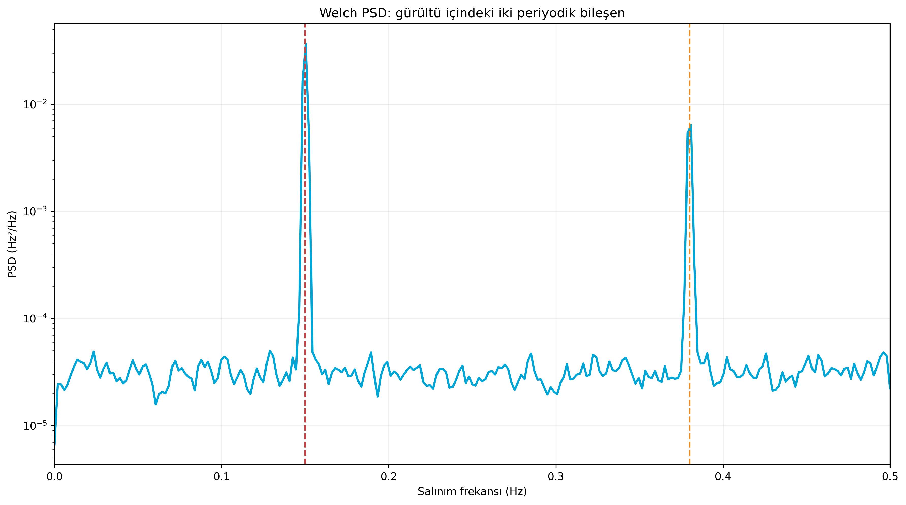
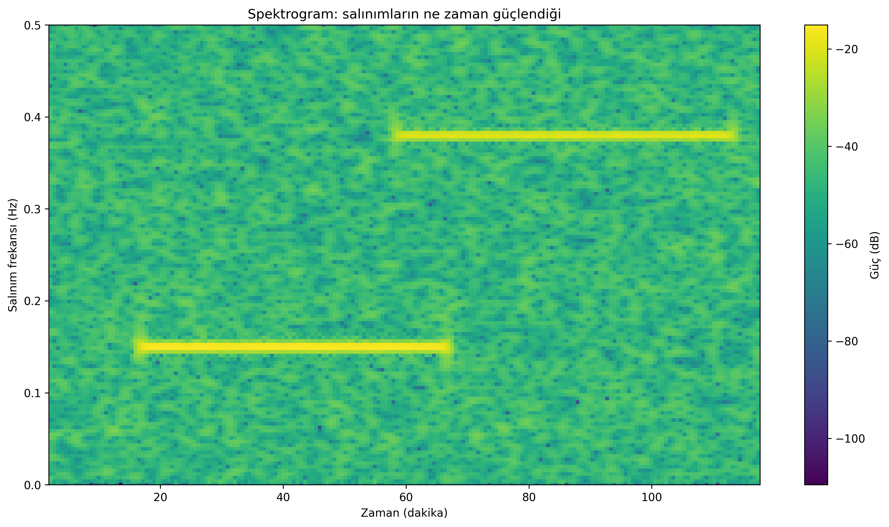
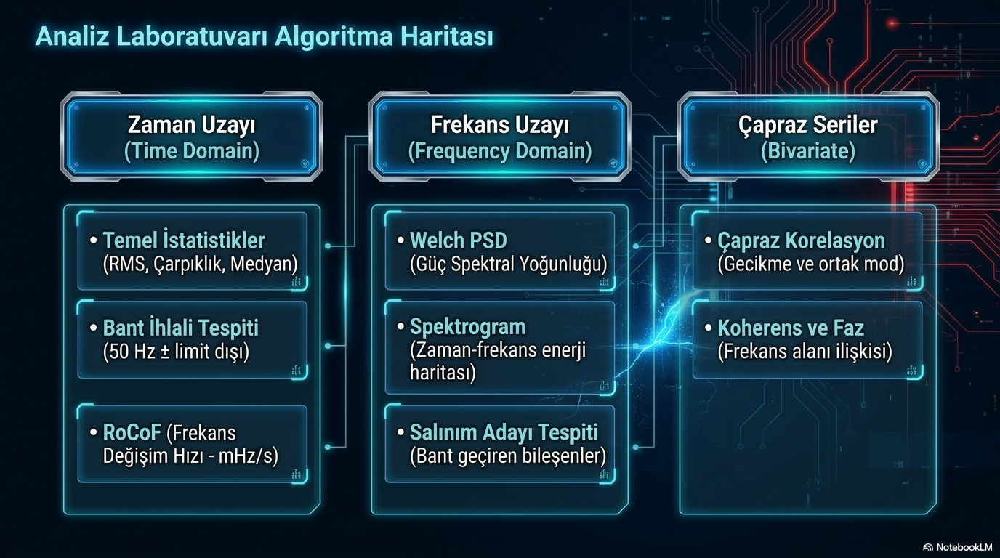

# Şebeke Salınımlarını Görünür Kılmak

**Alt başlık:** Welch PSD ve spektrogram ile frekans verisindeki gizli periyodik davranışları okumak

Frekans grafiğinde çıplak gözle görülmeyen salınımların güç spektral yoğunluğu ve zaman-frekans analiziyle nasıl ayrıştırıldığını sezgisel olarak anlatır.

> **Ana mesaj:** PSD “hangi salınım var?”, spektrogram “ne zaman güçlendi?” sorusunu yanıtlar. İkisini birlikte kullanmak tek başına FFT kullanmaktan daha açıklayıcıdır.

## Zaman grafiği neden bazen yetmez?

Bir günlük frekans eğrisine bakıldığında onlarca küçük dalgalanma üst üste görünür. Oysa bazı dalgalanmalar rastgele gürültü, bazıları düzenli kontrol davranışı, bazıları ise elektromekanik oscillation (salınım) olabilir. Bir sinyalin “hangi periyotlarda tekrar ettiğini” görmek için frekans alanına geçmek gerekir.

Power Spectral Density - PSD (güç spektral yoğunluğu), sinyal enerjisinin hangi salınım frekanslarında yoğunlaştığını gösterir. Buradaki frekans, 50 Hz şebeke frekansı değil; 50 Hz değerinin etrafındaki yavaş dalgalanmanın kendi salınım frekansıdır.

## Welch yöntemi neden tercih edilir?

Tek seferlik Fast Fourier Transform - FFT (hızlı Fourier dönüşümü), özellikle gürültülü zaman serilerinde çok pürüzlü bir spektrum üretebilir. Welch yöntemi veriyi kısa ve örtüşen parçalara ayırır, her parçanın spektrumunu hesaplar ve sonuçları ortalar. Böylece rastgele gürültü azalırken tekrarlayan spektral tepeler belirginleşir.

Buradaki ana mühendislik ödünleşimi resolution versus variance (çözünürlük-varyans dengesi) olarak özetlenebilir. Uzun segment daha iyi frekans çözünürlüğü verir; daha çok ve kısa segment ise daha pürüzsüz fakat daha düşük çözünürlüklü bir sonuç oluşturur.

## Pencereleme ve spektral sızıntı

Analiz penceresi bir salınım periyodunun tam katı değilse enerji komşu frekans kutularına yayılır. Buna spectral leakage (spektral sızıntı) denir. Hann veya Hamming gibi window function (pencere fonksiyonu) seçenekleri uçları yumuşatarak sızıntıyı azaltır.

Dikdörtgen pencere en dar ana loba sahip olsa da yan lobları güçlüdür. Bu yüzden zayıf bir modu güçlü bir komşu bileşenin yanında arıyorsanız Hann/Hamming çoğu zaman daha güvenli bir ilk tercihtir.

## Spektrogram: “ne zaman?” sorusunun cevabı

Welch PSD tüm analiz aralığının ortalama spektral imzasını verir; ancak salınım yalnızca 20 dakika sürdüyse bu süre bilgisi kaybolabilir. Short-Time Fourier Transform - STFT (kısa zamanlı Fourier dönüşümü) tabanlı spektrogram, aynı spektrumu kayan pencerelerle zamana böler.

Grafikte yatay eksen zaman, dikey eksen salınım frekansı, renk/yoğunluk ise spektral güçtür. Böylece bir modun günün hangi saatinde başladığı, güçlendiği ve söndüğü görülebilir.

## “Tepe gördüm, arıza var” demeden önce

Spektral tepe tek başına kararsızlık kanıtı değildir. Yük döngüleri, AGC davranışı, saatlik piyasa geçişleri veya veri işleme artefaktları da tepe üretebilir. Bir adayın önemini değerlendirmek için süreklilik, genlik, damping (sönümleme), farklı ölçüm noktalarındaki koherens ve olayla zaman ilişkisi birlikte incelenmelidir.

GridFreq kaynakları 0.1-0.8 Hz civarını bölgeler arası (inter-area) ve yaklaşık 0.8-2 Hz aralığını yerel (local) salınımlar için tipik mühendislik aralıkları olarak ele alır. Bunlar katı sınırlar değil, başlangıç sınıflandırmasıdır.

## PowerPoint içeriğiyle genişletilmiş okuma: algoritma haritası

Analiz Laboratuvarı sunumunda zaman uzayı (time domain / zaman alanı) ile frekans uzayı (frequency domain / frekans alanı) araçları aynı harita üzerinde gösteriliyor. Temel istatistikler, bant ihlali tespiti ve RoCoF aynı tarafta yer alırken; Welch PSD, spektrogram, koherens ve salınım adayı tespiti diğer tarafta konumlandırılıyor. Bu şema, yöntemler arasındaki ilişkiyi çok daha net hâle getirir.

Böylece okuyucu hangi soruda hangi araca gitmesi gerektiğini daha iyi anlar: “ani olay var mı?” için RoCoF, “tekrarlı periyodik davranış var mı?” için PSD, “zaman içinde mod ne zaman güçleniyor?” için spektrogram, “iki nokta aynı modu paylaşıyor mu?” için koherens kullanılmalıdır.

## Ağır hesaplamaların arka planda çalıştırılması neden önemlidir?

Sunumlarda Web Worker (tarayıcı içi arka plan iş parçacığı) vurgusu da bulunuyor. Bunun mühendislik karşılığı şudur: PSD veya koherens gibi nispeten ağır işlemler arayüzü kilitlemeden çalıştırılabilir. Bu da GridFreq’i sadece bir rapor ekranı değil, etkileşimli bir laboratuvar hâline getirir.

## Kaynaklar ve editoryal not

Bu metin, kullanıcı tarafından sağlanan GridFreq teknik dokümanları temel alınarak hazırlanmıştır. Simülasyon sonuçları model/senaryo bağımlı olarak ifade edilmiştir; mevzuatla ilgili kritik noktalar güncel TEİAŞ/ENTSO-E kaynaklarıyla karşılaştırılmıştır.

- Ekli kaynak: `gridfreq-spectral-analysis-report.pdf`

- Ekli kaynak: `gridfreq-technical-manual.pdf`

> GridFreq bağımsız bir analiz platformudur; metin resmî sistem işletmecisi görüşü değildir.
