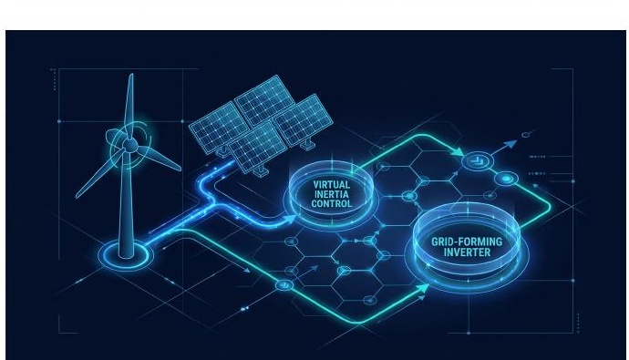
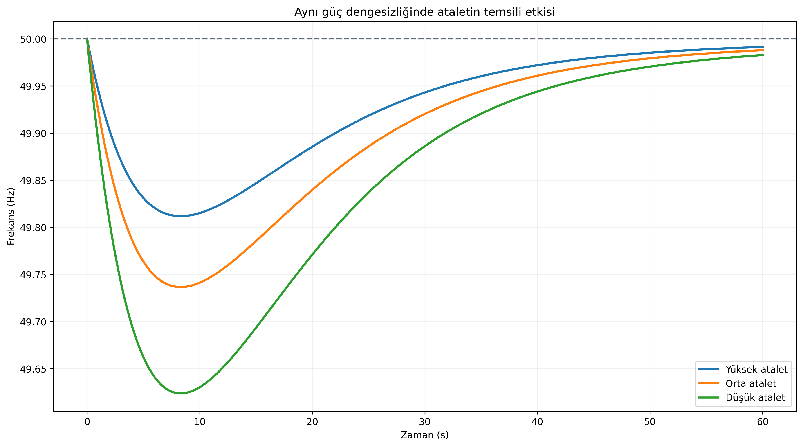
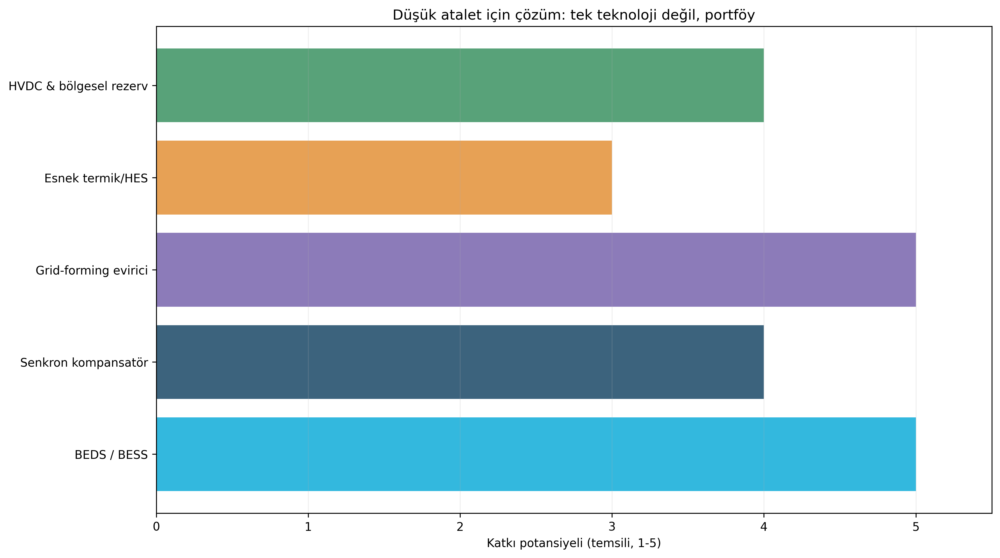
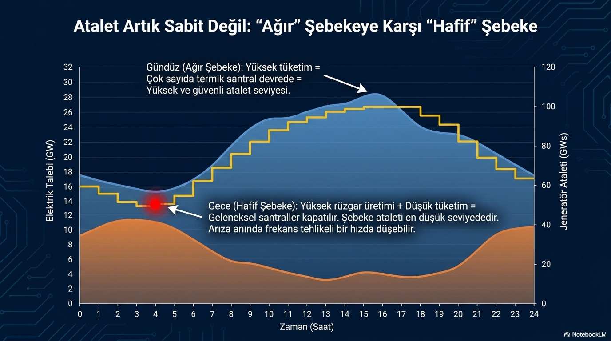

# Yenilenebilir Enerji Artarken Şebeke Ataleti Neden Gündeme Geliyor?

**Alt başlık:** Düşük atalet, RoCoF, sönümleme ve esneklik çözümlerini senaryo üzerinden anlamak

Rüzgâr ve güneş entegrasyonunun “yenilenebilir oranı arttı = sistem kararsız” gibi basit bir eşitlik olmadığını; kritik olanın senkron kaynak bileşimi, şebeke gücü ve kontrol yeteneği olduğunu açıklar.

> **Ana mesaj:** Yenilenebilir oranı bir sonuç değil girdidir. Güvenliği belirleyen, o anda şebekede kalan senkron enerji, rezerv hızı, şebeke gücü ve evirici kontrol yeteneğidir.

## Atalet neden azalabilir?

Geleneksel senkron jeneratörler şebekeye doğrudan bağlı dönen kütleleriyle doğal rotational inertia (döner atalet) sağlar. Güneş santralleri ve birçok modern rüzgâr türbini ise inverter (evirici) üzerinden bağlandığı için mekanik enerjileri şebeke frekansına doğrudan bağlı değildir.

Bu yüzden yenilenebilir üretim arttığında aynı anda çok sayıda senkron ünite devreden çıkarılıyorsa sistemdeki doğal kinetik enerji azalabilir. Sonuç, aynı büyüklükteki üretim kaybında daha yüksek RoCoF ve daha erken/derin frekans nadiri olabilir.

## Yenilenebilir yüzdesi tek başına kararlılık sınırı değildir

Ekli DIgSILENT PowerFactory senaryosu %15, %20 ve %30 yenilenebilir penetrasyonlarını karşılaştırıyor ve daha yüksek penetrasyonda daha ağır salınımlar gösteriyor. Bu sonuç, kullanılan model, hangi senkron jeneratörlerin devreden çıkarıldığı, yük seviyesi, ağ topolojisi, AVR/PSS ayarları ve yenilenebilir kontrol modelleri için geçerlidir.

Bu nedenle “Türkiye %20’nin üzerinde kararsız olur” gibi bir genelleme teknik olarak doğru değildir. Gerçek işletme sınırı anlık inertia (atalet), short-circuit strength (kısa devre gücü), reserve availability (rezerv mevcudiyeti), transfer seviyeleri ve inverter kontrol özelliklerinin birleşimidir.

## Düşük ataletin görünen belirtileri

Düşük atalet koşullarında ilk değişen ölçüt genellikle RoCoF’tur. Fakat sistem dayanıklılığını yalnızca RoCoF belirlemez. Primer rezervin ne kadar hızlı geldiği, yüklerin frekans duyarlılığı ve enterkonneksiyon desteği nadir noktasını doğrudan etkiler.

Aynı zamanda inverter ağırlıklı sistemlerde voltage control (gerilim kontrolü), weak-grid interactions (zayıf şebeke etkileşimleri) ve control-system oscillations (kontrol sistemi salınımları) ayrı bir kararlılık konusu hâline gelir.

## Çözüm seti: tek teknoloji değil portföy

Battery Energy Storage System - BESS/BEDS (batarya enerji depolama sistemi), hızlı aktif güç tepkisi sağlayarak frekans nadirini iyileştirebilir. Synchronous condenser (senkron kompansatör) kısa devre gücü ve fiziksel atalet; grid-forming inverter (şebeke oluşturan evirici) ise hızlı frekans ve gerilim desteği sağlayabilir.

Bunlara ek olarak konvansiyonel ünitelerin minimum yüklerinin düşürülmesi, daha hızlı rampalar, HVDC desteği, bölgesel rezerv paylaşımı ve dinamik güvenlik kısıtlarının piyasa/işletme planlamasına eklenmesi gerekir.

## GridFreq ile hangi göstergeler izlenebilir?

Frekansın yalnızca günlük ortalamasına bakmak düşük atalet sorununu göstermez. Olay bazlı maksimum RoCoF, nadir dağılımı, toparlanma süresi, spektral salınım modları ve Türkiye-Kıta Avrupası fark serisi birlikte izlenmelidir.

Zaman içinde aynı büyüklükteki olayların daha yüksek RoCoF üretmeye başlaması, sistem koşullarındaki değişim için güçlü bir erken uyarı göstergesi olabilir; yine de olay büyüklüğü ve işletme noktasıyla normalize edilmeden doğrudan “atalet azaldı” sonucuna gidilmemelidir.

## Yenilenebilir enerji oranı ile sistem ataleti aynı şey değildir

Atalet seviyesi, yalnızca talep, günün saati veya yenilenebilir üretimin yüzdesiyle belirlenmez. Asıl büyüklük, o anda şebekeye senkron bağlı makinelerin döner kütlelerinde depolanan toplam kinetik enerji ve sistemin dinamik bileşimidir. Aynı yenilenebilir üretim payında bile çevrim içi senkron jeneratör sayısı, hangi makinelerin yüklendiği, enterkonneksiyon akışları ve senkron kompansatörlerin durumu farklı olabilir.

Batarya ile inverter denetimleri, rezerv miktarı ve sistem topolojisi de frekans performansını değiştirir. Bu kaynaklar doğal mekanik ataletin doğrudan karşılığı değildir; fakat uygun denetim, baş boşluğu ve enerji bütçesiyle ilk frekans davranışını destekleyebilir. Bu nedenle “yüksek yenilenebilir oranı = düşük atalet” yalnızca belirli işletme koşullarında geçerli olabilecek eksik bir kısaltmadır.

## Senaryo sonuçlarını doğru sınırda tutmak

Yenilenebilir payı değiştirilen bir dinamik benzetim, seçilmiş model ve olay için değerli bir hassasiyet çalışmasıdır. Ancak yüzde 15, 20 veya 30 gibi örnekler Türkiye sistemi için evrensel güvenli ya da kararsız sınırlar üretmez. Sonuç; devreden çıkarılan senkron makineler, olayın büyüklüğü ve yeri, yük seviyesi, ağ topolojisi, AVR/PSS ayarları, inverter modelinin ayrıntısı ve koruma varsayımlarına bağlıdır.

Mühendislikte doğru soru “hangi yenilenebilir oranı güvenlidir?” değil, “bu işletme anında bu bozuntu için yeterli kinetik enerji, hızlı rezerv, kısa devre gücü ve denetim marjı var mı?” sorusudur. Bu yaklaşım, planlama çalışmalarını bir yüzdelik hedefe indirgemek yerine koşula bağlı güvenlik değerlendirmesine taşır.

## Düşük atalet yalnızca frekans problemi midir?

Düşük atalet, ilk olarak daha yüksek RoCoF ve daha dar frekans nadiri marjı şeklinde görünür. Bununla birlikte aynı işletme koşulları kısa devre gücü, gerilim toparlanması, dönüştürücü etkileşimleri ve denetim kararlılığı için de önem taşıyabilir. Zayıf şebekede çalışan inverterler; akım limiti, PLL davranışı, gerilim desteği ve diğer denetleyicilerle etkileşim nedeniyle frekans grafiğinde görünmeyen ek riskler yaratabilir.

Bu yüzden frekans performansı ile gerilim/fault dayanımı aynı çalışma başlığı altında fakat farklı teknik araçlarla incelenmelidir. Hızlı aktif güç tepkisi nadiri iyileştirebilir; ancak tek başına yeterli kısa devre gücü, gerilim desteği veya koordineli koruma sağlamaz. Çözüm seti, senkron kapasite, depolama, şebeke oluşturan denetim, iletim güçlendirmesi ve işletme rezervlerini birlikte içeren bir portföy olmalıdır.

## GridFreq ile ne gözlemlenebilir?

GridFreq, olaylar arasındaki RoCoF, nadir, toparlanma süresi ve düşük frekanslı davranış farklarını karşılaştırmaya imkân verir. Benzer boyuttaki aday olaylarda ilk eğimin zaman içinde değişmesi, daha ayrıntılı işletme analizi için işaret olabilir. Fakat olay büyüklüğü, başlangıç frekansı ve rezerv koşulları bilinmeden bu farklılık doğrudan atalet değişimi olarak etiketlenemez.

En sağlam çıkarım, tek bir teknolojinin üstünlüğünü ilan etmek değil; fiziksel tampon, hızlı denetim, enerji sürdürülebilirliği ve işletme koordinasyonunun birlikte tasarlanması gerektiğidir. Enerji dönüşümü frekans güvenliğini basitleştirmez; değerlendirilmesi gereken dinamik değişkenlerin sayısını artırır.

## Planlama ile gerçek zamanlı işletme arasındaki köprü

Planlama çalışmaları, olası üretim bileşimleri ve arıza senaryoları altında hangi güvenlik marjının gerekli olabileceğini gösterir. Gerçek zamanlı işletme ise bu varsayımların o anki karşılığını izler: çevrim içi senkron kapasite, yük seviyesi, enterkonneksiyon programı, batarya SOC’si ve kullanılabilir rezerv değişkendir. Aynı modelin iki farklı işletme anında farklı sonuç vermesi bu nedenle tutarsızlık değil, sistemin dinamik doğasıdır.

Dinamik güvenlik kısıtları, bu bağı planlama ve işletme arasında kurabilir. Amaç yenilenebilir üretimi tek bir sabit yüzdeye kadar sınırlamak değil; yeterli atalet, baş boşluğu, gerilim dayanımı ve denetim koordinasyonu bulunduğunda esnek işletmeye izin vermektir. Bu çerçeve, enerji dönüşümünü frekans güvenliğinin karşıtı değil, daha ayrıntılı mühendislik gerektiren bir tasarım problemi olarak ele alır.
