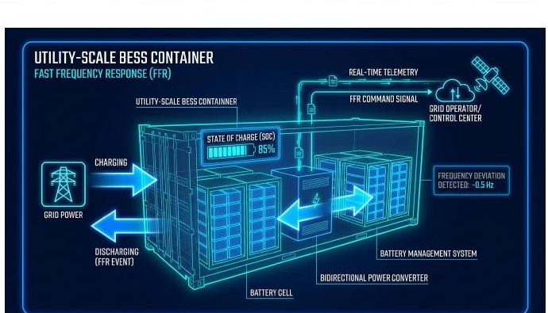
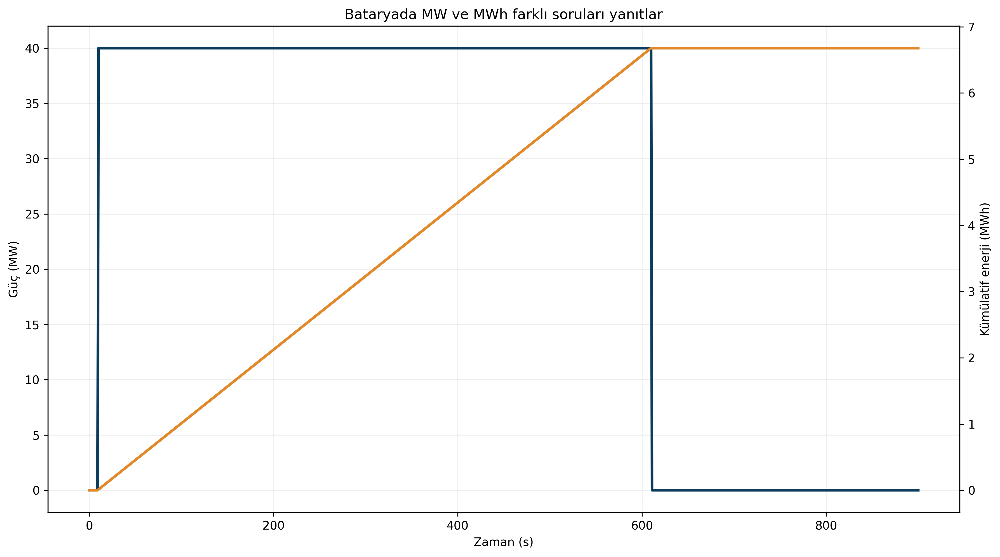
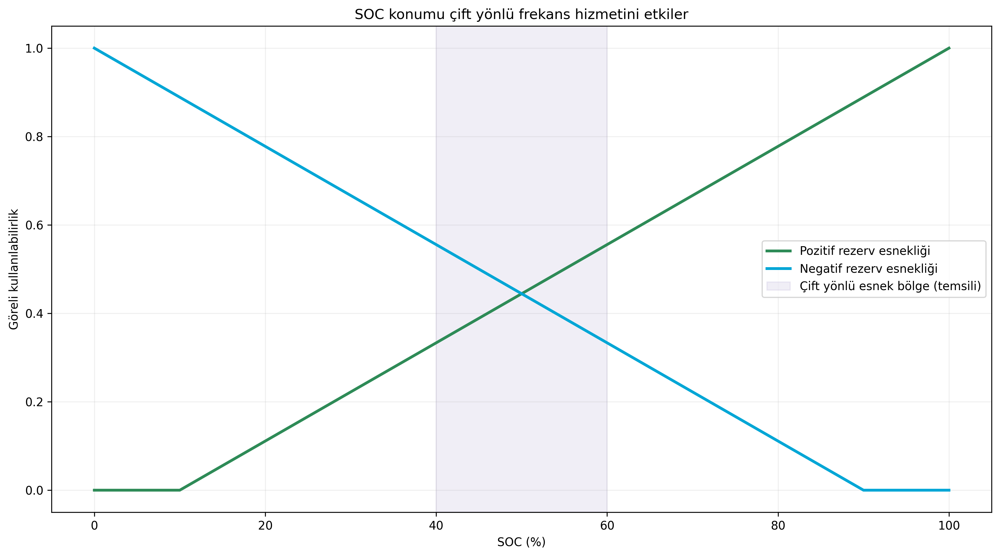

# Batarya Depolama Frekans Kontrolünde Ne Kadar Hızlı, Ne Kadar Uzun?

**Alt başlık:** BEDS/BESS için güç, enerji, SOC ve 2026 TEİAŞ teknik kriterlerini birlikte okumak

Bataryanın “çok hızlı” olmasının tek başına yeterli olmadığını; MW tepki, MWh enerji kapasitesi, SOC sınırları ve yeniden depolama stratejisinin birlikte tasarlanması gerektiğini açıklar.

> **Ana mesaj:** Bataryada “hız” MW ile, “dayanma süresi” MWh ile, hizmetin devamlılığı ise SOC yönetimi ile belirlenir.

## Güç ile enerji aynı şey değildir

Bir batarya 100 MW güç verebilir fakat bu, 100 MW’ı ne kadar süre sürdürebileceğini söylemez. Power (güç, MW) anlık tepki kapasitesini; energy (enerji, MWh) ise bu tepkinin süreyle çarpılmış enerji bütçesini temsil eder.

Frekans hizmetlerinde hızlı cevap için güç elektroniği kapasitesi, uzun süreli rezerv içinse kullanılabilir enerji ve State of Charge - SOC (şarj durumu) birlikte belirleyicidir.

## TEİAŞ 2026 PFK çerçevesinde depolama

TEİAŞ’ın 03 Temmuz 2026 tarihli güncel prosedürüne göre PFK’ya katılacak depolama ünite/tesisleri için iletim sistemine bağlı olma ve en az 30 MW depolama kurulu gücü gibi koşullar tanımlanmıştır. 200 mHz’lik frekans sapmasında rezervin %50’sinin en geç 15 saniyede, tamamının en geç 30 saniyede etkinleştirilmesi; tepki gecikmesinin 2 saniyeyi aşmaması ve çıkışın en az 15 dakika sürdürülebilmesi istenir.

Aynı doküman, her bir saat için reserve energy capacity / reserve power capacity (rezerv enerji kapasitesi / rezerv güç kapasitesi) oranının en az 1.25 olmasını ve PFK’nın azami ±10 mHz ölü bantla sağlanabilmesini ister.

## SOC neden bir kontrol değişkenidir?

SOC çok düşükse batarya pozitif rezerv (şebekeye güç verme) için enerjisiz kalabilir; çok yüksekse negatif rezerv (şebekeden güç çekme) için şarj alanı kalmaz. Bu nedenle çift yönlü frekans hizmetinde orta SOC bölgesi operasyonel esneklik sağlar.

2026 TEİAŞ prosedürü enerji yeterliliği izlenirken işletme doluluk alt sınırını %5, üst sınırını %95 kabul eden ve hesaplanan sınırlara ilave güvenlik marjı uygulayan bir yaklaşım tarif eder. Bu, “bataryayı hep %50’de tutmak gerekir” gibi tek bir sabit reçeteden daha esnek bir enerji yönetimi gerektirir.

## Hızlı frekans kontrolü ve atalet desteği

Bataryalar klasik PFK’dan daha hızlı davranabilir. TEİAŞ 2026 prosedürü Fast Frequency Control (hızlı frekans kontrolü) ile Inertia Support Service (atalet destek hizmeti) kavramlarını ayrıca tanımlar. Atalet desteğinde Phase Jump (faz açısı sıçraması) ve RoCoF (frekans değişim hızı) tepkileri özellikle anılır.

Bu hizmetlerin kontrol tasarımı klasik droop (hız eğimi) denetiminden farklı olabilir. Aşırı yüksek kazanç, ölçüm gürültüsünü büyütebilir ve SOC’yi hızlı tüketebilir; bu nedenle güç sınırı, ramp rate (rampa hızı), filtre ve enerji toparlama mantığı birlikte tasarlanmalıdır.

## Ekonomi ve ömür

Batarya frekans hizmeti verirken çok sayıda küçük şarj-deşarj döngüsü yaşar. Bu döngüler cycle aging (döngüsel yaşlanma), yüksek SOC’de uzun bekleme ise calendar aging (takvim yaşlanması) üzerinde etkili olabilir.

Optimum kontrol yalnızca en yüksek yan hizmet gelirini değil; hücre sıcaklığını, SOC aralığını, derin deşarjı, verimi ve uzun vadeli kapasite kaybını da hesaba katmalıdır. Kaynak teknik rehber, deadband (ölü bant), depth of discharge - DOD (deşarj derinliği) ve SOC hedefinin çok kriterli optimizasyonla birlikte seçilmesini önerir.

## PowerPoint içeriğiyle genişletilmiş okuma: atalet ve PFR uyumu

Sunumlar, atalet ile birincil frekans tepkisini iki ayrı ama uyumlu mekanizma olarak açıklıyor. Bu perspektif bataryalar için özellikle önemlidir; çünkü bataryalar klasik senkron atalet üretmese de çok hızlı aktif güç tepkisi vererek ilk saniyelerdeki boşluğu azaltabilir.

Ancak batarya hizmetinin başarılı olması için yalnızca hızlı güç elektroniği yetmez. Güç sınırı, enerji bütçesi, SOC (state of charge / şarj durumu) hedefi ve olay sonrası yeniden dengeleme stratejisi de birlikte tasarlanmalıdır. Aksi hâlde batarya ilk saniyelerde etkileyici görünse bile 15 dakikalık sürdürülebilirlik hedeflerinde zorlanabilir.

## Dijital hızın değeri

Sunumların “fiziksel kütleden dijital hıza” yaklaşımı, depolamanın neden bu kadar kritik olduğunu gösterir. Batarya, yavaş mekanik valflerin aksine milisaniyeler-seviyesinde kontrol üretebilir; fakat bu hızın sisteme yararlı olabilmesi için iyi filtrelenmiş ölçüm ve doğru enerji yönetimi gerekir.

## Kaynaklar ve editoryal not

Bu metin, kullanıcı tarafından sağlanan GridFreq teknik dokümanları temel alınarak hazırlanmıştır. Simülasyon sonuçları model/senaryo bağımlı olarak ifade edilmiştir; mevzuatla ilgili kritik noktalar güncel TEİAŞ/ENTSO-E kaynaklarıyla karşılaştırılmıştır.

- Ekli kaynak: `gridfreq-technical-manual.pdf`

- Ekli kaynak: `gridfreq-renewable-penetration-report.pdf`

- Dış doğrulama: TEİAŞ 03.07.2026 depolama teknik kriterleri ve test prosedürleri.

> GridFreq bağımsız bir analiz platformudur; metin resmî sistem işletmecisi görüşü değildir.
