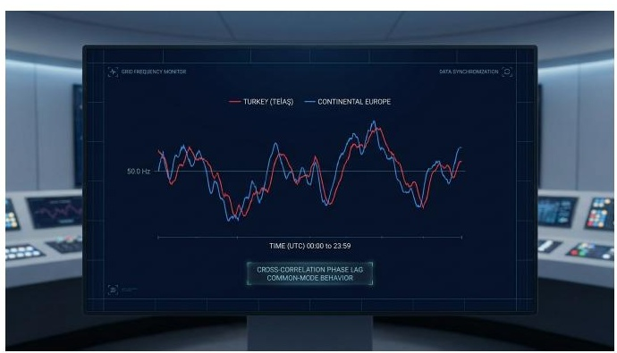
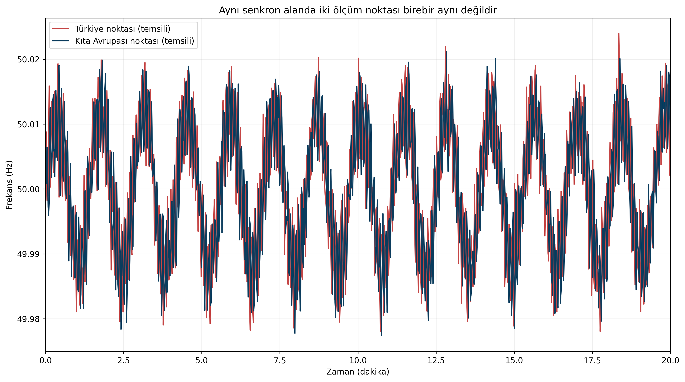
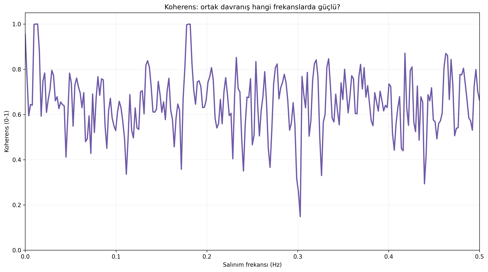
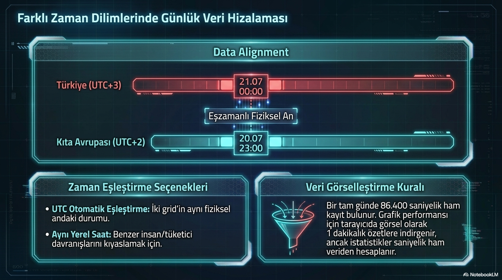

# Türkiye ve Kıta Avrupası Frekansını Birlikte Okumak

**Alt başlık:** Çapraz korelasyon, koherens ve ortak/diferansiyel mod ile iki seri ne anlatır?

Aynı 50 Hz senkron alanındaki iki frekans serisinin neden birebir aynı görünmediğini ve farkın nasıl mühendislik bilgisine dönüştürülebileceğini anlatır.

> **Ana mesaj:** İki frekans serisinin farkı “ölçüm hatası” olmak zorunda değildir; doğru zaman eşlemesiyle yerel ve bölgeler arası dinamikler için güçlü bir gözlem penceresine dönüşebilir.

## Aynı senkron alan, aynı ölçüm değil

Türkiye ile Kıta Avrupası senkron olarak aynı nominal 50 Hz frekansı paylaşır. Ancak iki farklı ölçüm noktasının anlık frekans serileri birebir aynı olmak zorunda değildir. Elektromekanik dalgaların yayılması, yerel üretim-yük dengesi, ölçüm cihazı filtresi ve zaman damgası farkları küçük ayrışmalar oluşturabilir.

Bu nedenle iki seri karşılaştırılırken ilk şart aynı zaman tabanı, aynı örnekleme aralığı ve güvenilir clock synchronization (saat senkronizasyonu) sağlamaktır.

## Çapraz korelasyon: benzerlik hangi gecikmede en yüksek?

Cross-correlation (çapraz korelasyon), serilerden birini zaman ekseninde ileri-geri kaydırarak benzerliğin nasıl değiştiğini ölçer. En yüksek korelasyonun oluştuğu gecikme, iki serideki ortak olayların hangi zaman kaymasıyla en iyi hizalandığını gösterir.

Bu gecikme doğrudan “elektriksel yayılma süresi” olarak yorumlanmamalıdır; ölçüm sistemlerinin filtreleri ve veri kaynaklarının yayın gecikmeleri de sonucu etkileyebilir. Gerçek fiziksel çıkarım için ölçüm zinciri gecikmelerinin ayrıca bilinmesi gerekir.

## Koherens: ilişki hangi salınım frekansında güçlü?

Magnitude-Squared Coherence (karesel koherens), iki sinyalin belirli salınım frekanslarında ne kadar birlikte hareket ettiğini 0 ile 1 arasında gösterir. Örneğin 0.2 Hz civarında yüksek koherens, her iki ölçüm noktasında ortak bir düşük frekanslı mod bulunduğuna işaret edebilir.

Cross-spectrum phase (çapraz spektrum fazı) ise aynı modun iki noktadaki faz ilişkisini gösterir. Birden çok ölçüm noktası ve güvenilir saat eşlemesi varsa bölgeler arası salınım şekillerinin incelenmesinde değerli bir araçtır.

## Ortak mod ve diferansiyel mod

Common mode (ortak mod), iki serinin birlikte hareket eden kısmını; differential mode (diferansiyel mod) ise aralarındaki göreli hareketi vurgular. Ortak mod, geniş senkron alanı etkileyen büyük üretim-tüketim dengesizliklerini daha görünür hâle getirebilir.

Diferansiyel mod ise Türkiye’nin Kıta Avrupası referansına göre göreli davranışını, inter-area oscillation (bölgeler arası salınım) ve lokal etkileri incelemek için yararlıdır. Ancak iki noktadan tek başına olayın kaynağını kesin olarak belirlemek çoğu zaman mümkün değildir.

## Pratik bir analiz sırası

Önce veri kalitesini ve zaman damgalarını doğrulayın. Ardından fark serisini ve basit korelasyonu inceleyin. Bir olay veya periyodik davranış varsa Welch PSD ile her iki serinin spektrumunu çıkarın; son aşamada koherens ve faza geçin.

Bu sıra, ileri analizleri veri kalitesi problemi üzerinde çalıştırma riskini azaltır ve görülen faz farklarının gerçekten şebekeden mi yoksa veri boru hattından mı kaynaklandığını ayırmaya yardımcı olur.

## PowerPoint içeriğiyle genişletilmiş okuma: zaman dilimi ve veri hizalama

Sunumlarda en dikkat çekici konulardan biri, Türkiye ile Kıta Avrupası verisinin farklı zaman dilimlerinden gelip ortak bir UTC ekseninde hizalanmasıdır. Bu teknik ayrıntı küçük görünse de karşılaştırmalı frekans analizinin güvenilirliği doğrudan buna bağlıdır.

Aynı fiziksel anı mı kıyaslıyoruz, yoksa aynı yerel saati mi? Bu iki yaklaşım farklı soruları yanıtlar. UTC eşleştirmesi elektriksel olayların aynı anda nasıl hissedildiğini göstermek için uygundur. Aynı yerel saat karşılaştırması ise tüketim alışkanlığı ve piyasa geçişleri gibi günlük davranışları kıyaslamada yararlıdır.

## İki seri neden birebir aynı görünmez?

Sunumlar, senkronizasyonun “özdeş eğri” anlamına gelmediğini de dolaylı olarak anlatıyor. Ölçüm filtresi, yayın gecikmesi, yerel olaylar ve zaman damgası farkları küçük ayrışmalar üretebilir. Bu nedenle makaledeki çapraz korelasyon ve koherens araçları, yalnızca görsel kıyasın ötesine geçmek için gereklidir.

## Kaynaklar ve editoryal not

Bu metin, kullanıcı tarafından sağlanan GridFreq teknik dokümanları temel alınarak hazırlanmıştır. Simülasyon sonuçları model/senaryo bağımlı olarak ifade edilmiştir; mevzuatla ilgili kritik noktalar güncel TEİAŞ/ENTSO-E kaynaklarıyla karşılaştırılmıştır.

- Ekli kaynak: `gridfreq-technical-manual.pdf`

- Dış doğrulama: ENTSO-E/Fingrid sistem işletme ve frekans kalite yayınları.

> GridFreq bağımsız bir analiz platformudur; metin resmî sistem işletmecisi görüşü değildir.
