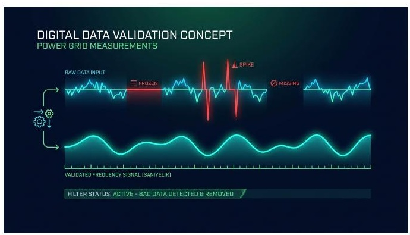
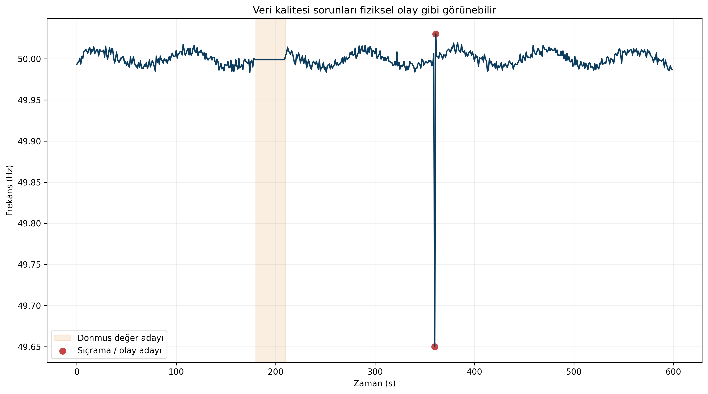
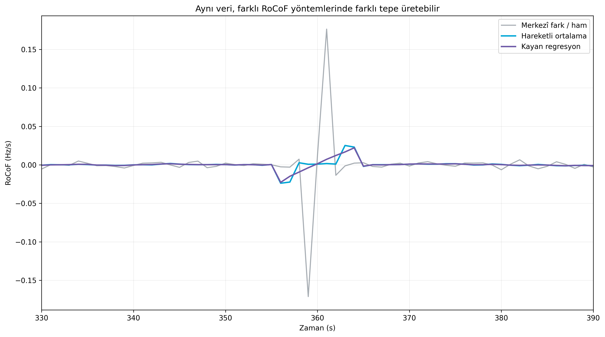
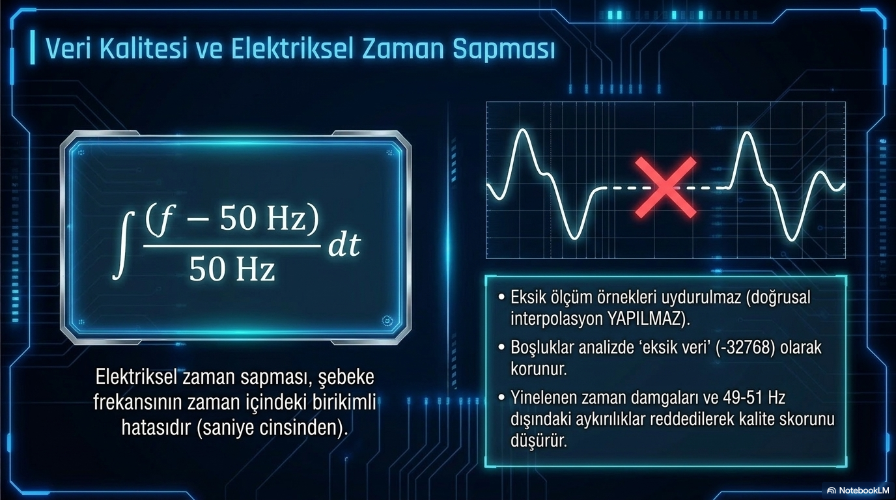

# Güvenilir Frekans Analizinin Temeli: Veri Kalitesi

**Alt başlık:** Eksik örnek, donmuş değer, zaman damgası ve filtre seçimi sonuçları nasıl değiştirir?

Gelişmiş RoCoF, PSD veya olay analizi öncesinde veri kalitesinin neden bir “ön işlem” değil, analizin parçası olduğunu açıklar.

> **Ana mesaj:** Veri kalitesi analizin giriş kapısı değil, güven skorudur. Ham veriyi koruyun; olağandışı değeri silmek yerine önce etiketleyin.

## En gelişmiş algoritma kötü veriyi düzeltemez

Frekans analizi saniyelik veya daha hızlı serilerle çalışır. GPS saat kaybı, ağ kesintisi, sensör donması ve veri kaynağındaki yeniden örnekleme gibi problemler küçük görünse de türev ve spektrum hesaplarında büyük hatalar yaratabilir.

Özellikle RoCoF gibi derivative (türev) tabanlı metrikler tek bir sıçramayı büyük bir fiziksel olay gibi büyütebilir. Bu nedenle veri kalitesi sonucu “analizden önce bir kez kontrol edilen” değil, her raporda görünür olan bir metrik olmalıdır.

## Zaman damgası ve örnek aralığı

Örneklerin sıralı, benzersiz ve beklenen zaman aralığında olması gerekir. Yerel saat kullanılıyorsa yaz-kış saati geçişleri 23 veya 25 saatlik günler oluşturabilir; en güvenli analiz tabanı çoğu durumda UTC (eşgüdümlü evrensel zaman) kullanmak ve yerel saati yalnızca gösterimde uygulamaktır.

İki farklı frekans kaynağı karşılaştırılacaksa milisaniye/saniye düzeyindeki saat farkı çapraz korelasyon ve faz analizini doğrudan etkiler.

## Donmuş değer ile kararlı şebekeyi ayırmak

Aynı frekans değerinin uzun süre art arda gelmesi “çok kararlı şebeke” anlamına gelebilir gibi görünse de pratikte ölçüm veya iletişim donmasının işareti olabilir. Duplicate-run (yinelenen değer dizisi) kontrolü bu yüzden önemlidir.

Ancak sabit bir 15 saniye eşiğini her cihaz ve veri kaynağı için evrensel kabul etmek doğru değildir. Ölçüm çözünürlüğü 1 mHz olan bir kaynağın aynı değeri tekrar etme olasılığı, 0.1 mHz çözünürlüklü bir kaynaktan farklıdır. Eşik kaynak bazlı kalibre edilmelidir.

## Frekans aralığı kontrolü: “imkânsız” ile “acil durum” aynı şey değildir

Kaynak teknik rehberde 49-51 Hz dışındaki değerlerin geçersiz olarak işaretlenmesi önerisi bulunur. Bu, normal gün veri temizliği için pratik olabilir ancak fiziksel olarak 49 Hz altı veya 51 Hz üstü değerler ağır sistem olaylarında mümkündür.

Daha güvenli yaklaşım hard reject (kesin silme) yerine iki kademeli kontroldür: cihazın fiziksel ölçüm aralığının dışındaki değerleri geçersiz saymak; 49-51 Hz gibi operasyonel bandın dışındakileri ise “olağandışı / olay adayı” olarak işaretleyip ham veriyi korumak.

## RoCoF ve filtre seçimi

Central difference (merkezî fark) en basit RoCoF yöntemidir fakat gürültüye hassastır. Moving average filtered derivative (hareketli ortalama filtreli türev) gürültüyü azaltır fakat tepeleri yumuşatabilir. Sliding linear regression (kayan doğrusal regresyon) daha kararlı bir eğim tahmini verir fakat pencere uzunluğu arttıkça hızlı olayları geciktirebilir.

Bu yüzden raporda yalnızca “maksimum RoCoF” değil; kullanılan örnekleme aralığı, filtre/pencere uzunluğu ve hesaplama yöntemi de verilmelidir. Aynı veri farklı filtrelerle farklı tepe değerleri üretebilir.

## Tekrar üretilebilir analiz

Agent veya RAG (bilgi geri çağırma) sistemi için en değerli çıktı, yalnızca sonuç paragrafı değil; veri kaynağı, zaman aralığı, parametreler, kullanılan görsel dosyaları ve varsa düzeltme notlarını içeren yapılandırılmış metadata (üst veri) paketidir.

Bu nedenle bu GridFreq içerik paketinde her makale için Markdown metin, metadata.json, ayrı yüksek çözünürlüklü görseller ve kaynak haritası birlikte verilmiştir.

## PowerPoint içeriğiyle genişletilmiş okuma: interpolasyonsuz veri ilkesi

Analiz Laboratuvarı sunumu, veri kalitesine yaklaşımın en kritik ilkesini çok açık biçimde özetliyor: eksik örnekler “uydurulmaz”, boşluklar gizlenmez ve kalite sorunu olan veri analitik katmanda ayrı biçimde taşınır. Bu ilke özellikle RoCoF ve zaman sapması gibi metriklerde yapay sonuçları önler.

Ayrıca yinelenen zaman damgaları, 49–51 Hz dışındaki aykırı değerler ve beklenmeyen zaman boşlukları kalite skorunu etkileyen olaylar olarak ele alınır. Bu yaklaşım sayesinde kullanıcı, yalnızca analizin sonucunu değil, sonucun ne kadar güvenilir olduğunu da görebilir.

## Neden ikili (binary) optimizasyon da bir kalite meselesidir?

Sunumlarda anlatılan int16 tabanlı sıkıştırma ve -32768 ile eksik veri işaretleme yaklaşımı yalnızca performans için değildir. Aynı zamanda eksik veriyi “ortalama ile doldurma” gibi analizi bozabilecek müdahalelerden kaçınmanın bir yoludur. Kısacası veri mühendisliği kararı, sonuçların teknik güvenilirliğinin bir parçasıdır.

## Kaynaklar ve editoryal not

Bu metin, kullanıcı tarafından sağlanan GridFreq teknik dokümanları temel alınarak hazırlanmıştır. Simülasyon sonuçları model/senaryo bağımlı olarak ifade edilmiştir; mevzuatla ilgili kritik noktalar güncel TEİAŞ/ENTSO-E kaynaklarıyla karşılaştırılmıştır.

- Ekli kaynak: `gridfreq-technical-manual.pdf`

- Ekli kaynak: `gridfreq-technical-manual (1).pdf`

> GridFreq bağımsız bir analiz platformudur; metin resmî sistem işletmecisi görüşü değildir.
