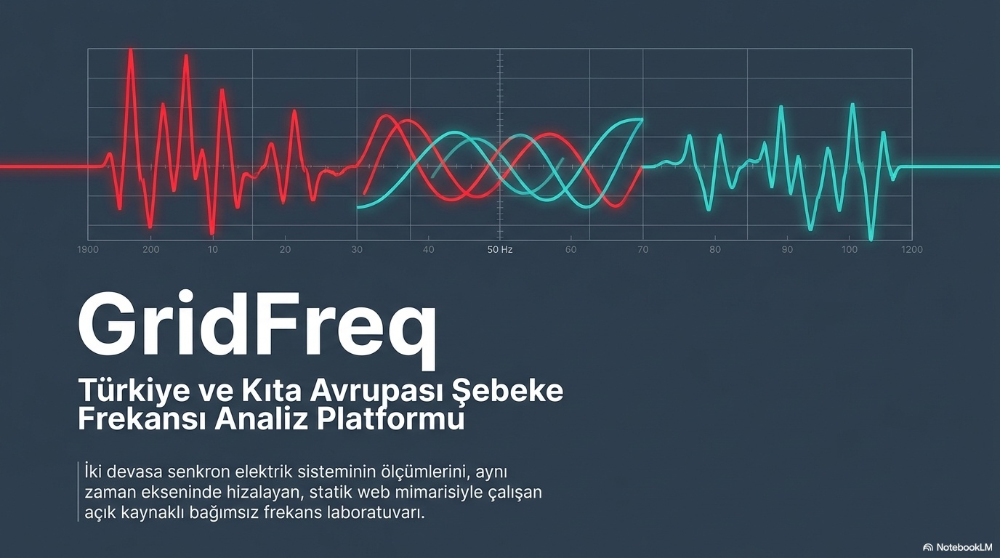
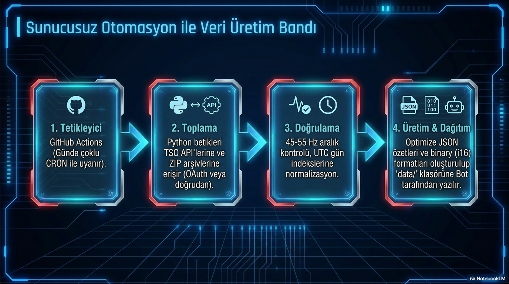

# GridFreq Analiz Laboratuvarı: Zaman Uzayından Frekans Uzayına

**Alt başlık:** Tek bir frekans eğrisinden olay, kalite ve salınım bilgisini nasıl çıkarıyoruz?

GridFreq Analiz Laboratuvarı, 1 saniyelik frekans verisini yalnızca çizmek için değil; aynı veri üzerinden olay tespiti, RoCoF (frekans değişim hızı), zaman sapması, salınım adayı tespiti ve iki şebekenin karşılaştırmalı analizi için kullanmak üzere tasarlanmıştır.

> **Ana mesaj:** İyi bir frekans laboratuvarı tek bir grafik değil; zaman alanı, frekans alanı ve veri kalitesi katmanlarını birlikte çalıştıran bir analiz düzenidir.

## Zaman alanı araçları neyi gösterir?

Zaman alanı (time domain / zaman uzayı) araçları, ham frekans serisinin olay bazlı davranışını görünür kılar. Ortalama sapma, bant ihlali, minimum–maksimum değerler ve RoCoF gibi göstergeler, operatör veya araştırmacının “az önce ne oldu?” sorusuna hızlı yanıt vermesini sağlar.

Bu katmanda amaç mümkün olduğunca doğrudan okumadır. Örneğin bir olay anında frekansın ne kadar hızlı düştüğü, kaç saniyede toparlanmaya başladığı ve 50 Hz’e göre ne kadar kalıcı sapma taşıdığı kolayca görülebilir. Fakat bu görünürlük, veri kalitesi zayıfsa yanıltıcı olabilir; bu nedenle zaman alanı analizi kalite denetimiyle birlikte ele alınmalıdır.

## Frekans alanına neden geçiyoruz?

Bazı olaylar tekil değildir; daha çok tekrarlı salınım kalıpları olarak ortaya çıkar. İşte burada frekans alanı (frequency domain / frekans uzayı) araçları devreye girer. Welch PSD (Welch güç spektral yoğunluğu) belirli frekans bantlarında gücün yoğunlaştığı noktaları gösterir; spektrogram ise bu yoğunlaşmanın günün hangi anlarında öne çıktığını anlamamıza yardım eder.

Böylece “şebeke bugün gürültülü müydü?” veya “0.2 Hz civarındaki bir mod hangi saatlerde güçlendi?” gibi sorular yanıtlanabilir. Bu tür araçlar, olay raporlarından farklı olarak sürekli izleme ve kök neden analizi için son derece değerlidir.

## Analiz laboratuvarının algoritma haritası

PowerPoint sunumunda gösterilen algoritma haritası, GridFreq’in farklı yöntemleri tek çatı altında nasıl birleştirdiğini güzel özetler. Zaman alanında temel istatistikler, bant ihlali tespiti ve RoCoF bulunurken; frekans alanında Welch PSD, spektrogram, koherens ve çapraz korelasyon yer alır.

Bu harita, kullanıcının sorun tipine göre doğru analizi seçmesini kolaylaştırır. Ani bir bozulma için RoCoF ve olay eğrisi yeterliyken, uzun dönemli etkileşimleri incelemek için koherens ve salınım aday analizine geçmek gerekir.

## Veri üretim bandı neden önemli?

Analiz laboratuvarı yalnızca bir arayüz değildir; arka planda çalışan otomatik bir veri üretim bandına dayanır. Sunumda gösterildiği gibi GitHub Actions ile tetiklenen toplama adımları, veri doğrulama, UTC normalizasyonu ve sıkıştırma aşamalarından geçer. Bu sayede kullanıcı tarayıcıda hazır, hızlı ve tutarlı bir veri paketiyle karşılaşır.

Bu veri üretim disiplini, araştırma sonuçlarının yeniden üretilebilir olmasını sağlar. Aynı ham veri, aynı iş kurallarıyla işlendiğinde benzer analitik sonuçlara ulaşmak mümkün olur; bu da GridFreq’in bağımsız araştırma aracı karakterini güçlendirir.

## Sonuç

GridFreq Analiz Laboratuvarı, frekans verisini yalnızca izlemek için değil, açıklamak için kurgulanmıştır. Zaman alanı, frekans alanı ve veri kalitesini bir arada değerlendirmek; şebeke frekansını rastgele dalgalanan bir çizgi olmaktan çıkarıp yorumlanabilir bir mühendislik sinyaline dönüştürür.

## Kaynaklar ve editoryal not

- Kaynak: `GridFreq_Analysis_Laboratory.pptx`
- Kaynak: `GridFreq_Analytics.pptx`
- Kaynak: `gridfreq-technical-manual.pdf`
