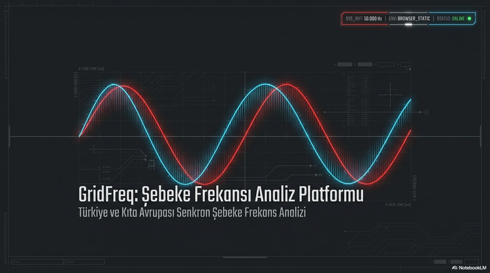
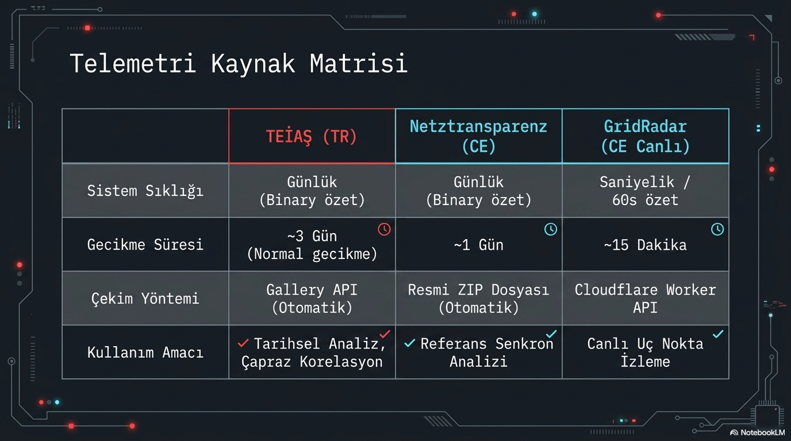
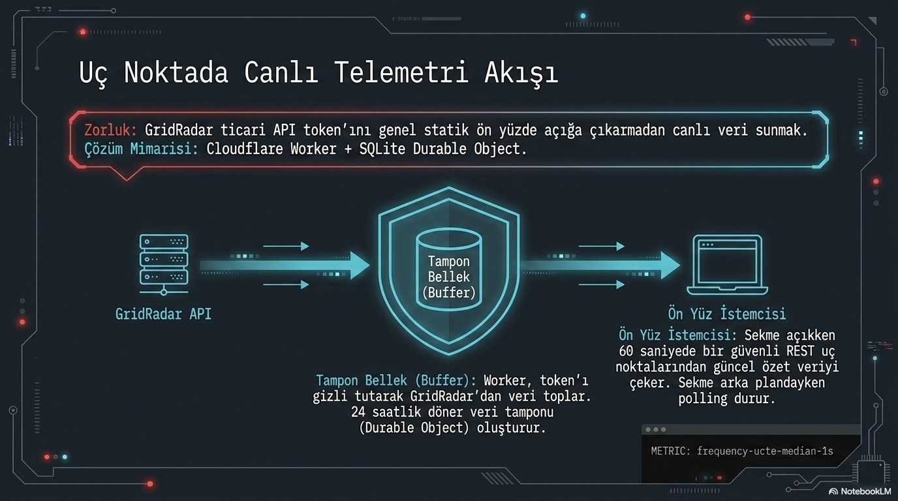
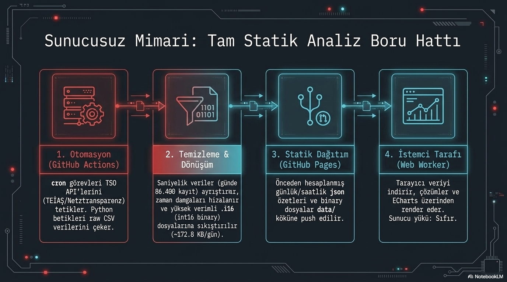

# GridFreq Platform Mimarisi: Statik Ön Yüz ve Serverless Veri Katmanıyla Şebeke Analizi

**Alt başlık:** Tarihsel veri, canlı erişim ve tarayıcı içi analiz aynı platformda nasıl ayrışır?

GridFreq, frekans verisini tek bir merkezi uygulama sunucusundan yayımlayan klasik bir mimari değildir. Tarihsel analiz için statik ön yüz, önceden üretilmiş veri paketleri ve tarayıcı içi hesaplama kullanılır. Canlı veri erişiminde ise kaynak anahtarlarını ve erişim kurallarını koruyan serverless bir ara katman devreye girer. Bu ayrım, her veri yolunun gecikme, maliyet ve güvenlik gereksinimine göre tasarlanmasını sağlar.

> **Ana mesaj:** Statik yayın, düşük maliyet ve yeniden üretilebilirlik sağlar; canlı veri ise güvenli bir ara katman ve kontrollü önbellek gerektirir.

## Tarihsel Türkiye verisinin yolu

Tarihsel Türkiye frekans verisinde akış, kaynak verinin alınmasıyla başlar. Toplama adımı, ham kayıtları indirir; tarih, saat, yinelenen kayıt, geçersiz değer ve beklenen örnek sayısı gibi kontrollerden geçirir. Zaman damgaları ortak analiz tabanına göre normalleştirilir, günlük özetler ve istemci için verimli paketler üretilir. Sonuç, GitHub Pages üzerinden yayımlanan statik dosyalar olarak tarayıcıya ulaşır.

Bu zincirde veri doğrulama, görselleştirmeden önce gelir. Tarayıcı, seçilen güne ait hazır paketi indirir; çözümleme, grafik çizimi ve bazı analizler istemci tarafında yapılır. Böylece her görüntüleme için merkezi bir veritabanına sorgu atmak yerine, aynı yayınlanmış paket birden çok kullanıcı tarafından yeniden kullanılabilir.

## Tarihsel Kıta Avrupası verisinin yolu

Kıta Avrupası serisinde kaynak yapısı ve arşiv biçimi farklı olabilir; yine de ana ilke aynıdır: kaynak veriyi almak, zaman tabanını doğrulamak, analiz için normalleştirmek ve paketlenmiş sonuçları statik olarak yayımlamak. Kaynağın yerel saat uygulaması, yayın gecikmesi ve dosya biçimi Türkiye serisinden farklı olabileceği için doğrulama kuralları kaynak bazında ele alınmalıdır.

Tarihsel iki serinin aynı platformda bulunması, onların aynı zaman çözünürlüğüne veya aynı ölçüm zincirine sahip olduğu anlamına gelmez. İstemci tarafındaki karşılaştırma, bu farkları veri kalitesi ve zaman eşleme bilgisiyle birlikte değerlendirmelidir. Statik veri katmanı, tarihsel tekrar üretilebilirlik için güçlüdür; canlı olay doğrulamasının yerine geçmez.

## Canlı veri için neden serverless ara katman gerekir?

Canlı API anahtarları veya kaynak erişim ayrıntıları tarayıcıya doğrudan verilmemelidir. Bu nedenle canlı veri yolu, API ile ön yüz arasına güvenli bir serverless ara katman yerleştirir. Cloudflare Worker gibi bir bileşen, erişim kurallarını uygular, yanıtı doğrular ve gerektiğinde tampon/önbellek katmanıyla istemciye kontrollü bir özet sunar. SQLite Durable Object benzeri kalıcı serverless bileşenler, kısa süreli durum ve güvenli paylaşım ihtiyacını destekleyebilir.

Bu tasarım canlı görünümü tarihsel paketlerden ayırır. Canlı veri; gecikme, kaynak erişilebilirliği ve önbellek politikası nedeniyle tarihsel seriden farklı davranabilir. Kullanıcı arayüzünde bu farkın açıkça belirtilmesi, yakın gerçek zamanlı değeri kesin ve gecikmesiz saha ölçümü sanma riskini azaltır.

## Neden bütün hesaplamaları merkezi sunucuda yapmıyoruz?

Önceden hazırlanmış paketlerin GitHub Pages üzerinde yayımlanması, statik barındırma maliyetini ve işletme karmaşıklığını düşürür. İstemci tarafı hesaplama, talebi kullanıcıların cihazlarına dağıtır; aynı veri ve aynı parametrelerle analizin yeniden üretilebilmesini kolaylaştırır. Tarayıcı, küçük ve orta boy zaman aralıklarında grafik, filtreleme ve temel sinyal işleme için yeterli esneklik sağlayabilir.

Bu yaklaşımın sınırları vardır. Tarayıcı CPU’su ve belleği cihazdan cihaza değişir; büyük dosyalar indirme süresini uzatır; önbellek eski içeriğin kısa süre daha görünmesine yol açabilir. Karmaşık ya da çok uzun analizler, kullanıcı deneyimini zorlayabilir. Bu nedenle mimari, her hesabı istemciye taşımak yerine yayınlanmış özetler, uygun veri çözünürlüğü ve arka plan işleme arasında denge kurmalıdır.

## Mimarinin mühendislik sonucu

GridFreq’in gücü, tek bir teknoloji etiketinde değil; veri yoluna uygun görev dağılımındadır. Tarihsel katman, otomasyon ve statik yayınla denetlenebilir veri paketleri üretir. Tarayıcı, bunları etkileşimli olarak inceler. Canlı katman ise güvenlik ve erişim sınırları için serverless bileşenlerden yararlanır. Bu yapı, sonuçların kaynak gecikmesi, önbellek durumu ve cihaz sınırlarıyla birlikte okunmasını gerektirir; doğru kullanıldığında düşük işletme maliyeti ile teknik şeffaflığı bir araya getirir.

## Operasyonel gözlemler ve sınırlar

Statik yayın modelinde her veri güncellemesi belirli bir üretim ve dağıtım anına bağlıdır. Bu, yayınlanmış tarihsel paketin hangi kurallarla üretildiğini izlemeyi kolaylaştırır; ancak kaynak gecikmesi veya başarısız toplama adımı varsa en yeni günün görünmemesine neden olabilir. Canlı katmanda ise önbellek, hız ve kaynak koruması için yararlıdır; buna karşılık kullanıcıya görünen değerle kaynağın son ölçümü arasında kontrollü bir gecikme yaratabilir.

Mimari kararların analitik sonuçla ilişkisi burada ortaya çıkar. Tarihsel eğri ile canlı ekran aynı başlık altında görünse bile güncellik, çözünürlük ve işleme zinciri farklı olabilir. Sağlam yorum, kullanılan veri yolunu, zaman damgasını ve erişim durumunu sonuçla birlikte değerlendirir.
