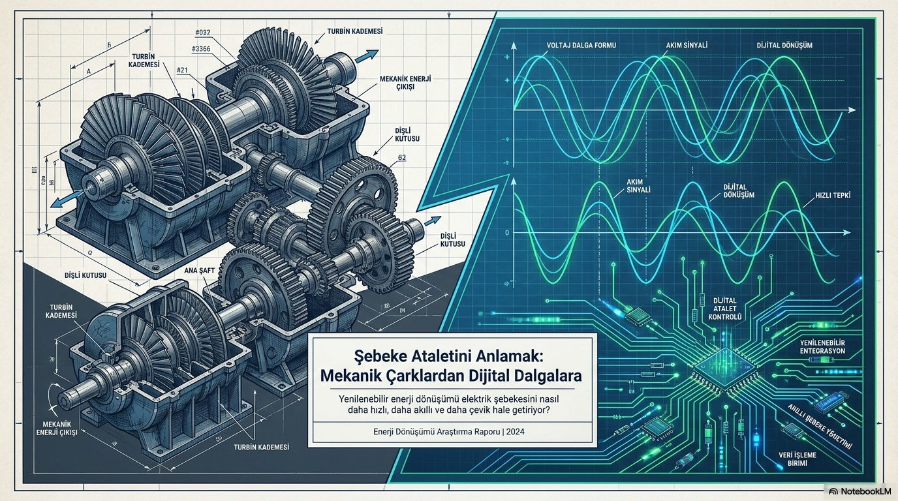
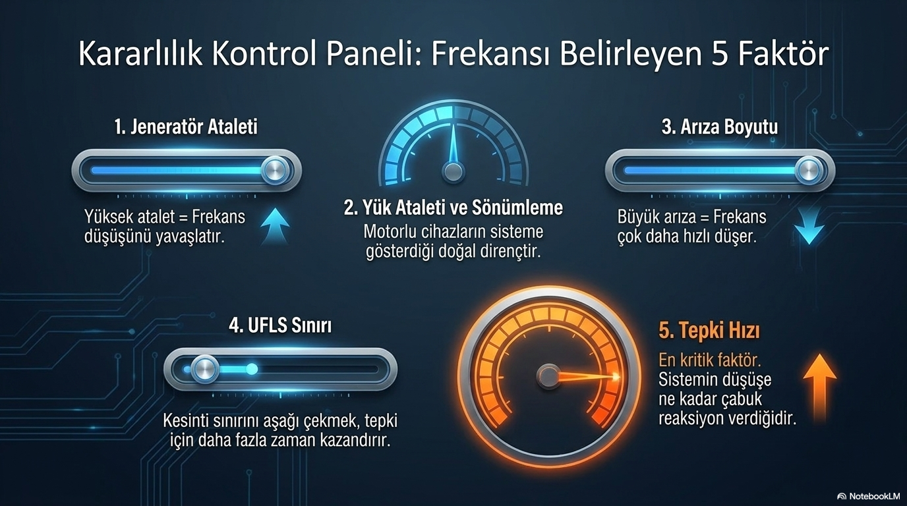
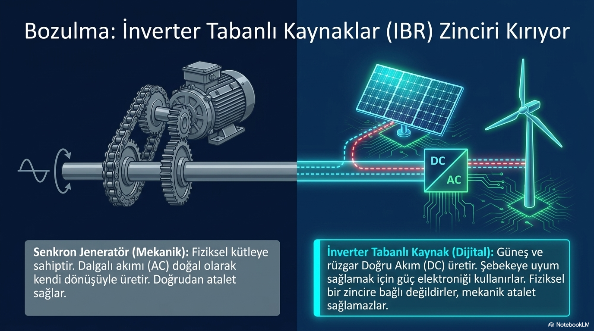

# Dijital Şebeke Devrimi: Mekanik Ataletten İnverter Çağına

**Alt başlık:** İnverter ağırlıklı dönüşüm, frekans güvenliği ve denetim koordinasyonunu nasıl değiştiriyor?

Enerji dönüşümü sadece üretim kaynağını değiştirmez; frekansı tutan fiziksel ve denetimsel mekanizmaların bileşimini de değiştirir. Senkron makinelerin ağırlıkta olduğu yapıda döner kütleler frekans değişimine doğal olarak karşı koyar. İnverter tabanlı kaynakların payı arttıkça, bu doğal yanıtın yerine hangi denetim işlevlerinin, hangi güç ve enerji sınırlarıyla konulacağı daha önemli hâle gelir.

> **Ana mesaj:** İnverterleşme frekans güvenliğini otomatik olarak azaltmaz veya artırmaz; sonuç, fiziksel sistem gücü ile denetim tasarımının birlikte nasıl kurulduğuna bağlıdır.

## Frekans olayının sonucunu etkileyen dinamikler ve koruma katmanları

Frekansın ilk davranışını doğrudan etkileyen değişkenler; sistemdeki toplam kinetik enerji, güç dengesizliğinin büyüklüğü, yük sönümlemesi, aktif güç tepkisinin hızı ve kullanılabilir rezervdir. Bunlar RoCoF’u, frekans nadirini ve geçici kararlı durum frekansını birlikte şekillendirir. Aynı atalet seviyesinde daha büyük üretim kaybı daha sert düşüş yaratabilir; aynı kayıpta daha hızlı ve sürdürülebilir rezerv nadiri iyileştirebilir.

Under Frequency Load Shedding - UFLS (düşük frekansta yük atma), bu dinamiklerin arasına konacak doğal bir değişken değildir. UFLS, frekans belirli eşiklere geldiğinde sistemi korumaya yönelik son savunma müdahalesidir. Doğal dengenin yerini almak üzere planlanmaz; talebi azaltarak daha ağır çöküşü önlemeyi amaçlar. Bu ayrım, koruma ayarını frekans performansının nedeni sanma hatasını önler.

## Grid-following ve grid-forming inverter aynı şey değildir

Grid-following inverter (şebeke takip eden inverter), çoğunlukla mevcut gerilim ve frekans referansını ölçer, bu referansa senkron olur ve tanımlı aktif/reaktif güç komutunu uygular. Güçlü ve kararlı bir şebeke referansına bağlı çalışacak biçimde tasarlanabilir. Grid-forming inverter (şebeke oluşturan inverter) ise kendi gerilim/frekans referansını oluşturacak veya destekleyecek denetim davranışı gösterebilir; ada işletimi, zayıf şebeke ve hızlı destek senaryolarında farklı imkânlar sunabilir.

Bu iki davranışın donanım etiketiyle otomatik oluştuğu varsayılamaz. Her inverter tabanlı kaynağın sentetik atalet, FFR veya şebeke oluşturma işlevi verdiğini söylemek doğru değildir. İşlev; denetim yazılımına, izin verilen akım sınırına, enerji kaynağına, koruma koordinasyonuna ve şebeke koduna bağlıdır.

## Düşük ataletli şebekede yalnızca hızlı tepki yeterli midir?

Hızlı aktif güç desteği, ancak yeterli headroom (güç baş boşluğu), inverter akım limiti içinde kalma ve yeterli enerji kapasitesi varsa anlamlıdır. Batarya çok hızlı güç verebilir; fakat şarj durumu düşükse bu desteği sürdüremez. Yüksek kazançlı denetim, ölçüm gürültüsünü ve diğer denetleyicilerle etkileşimi büyütebilir. Gerilim desteği, kısa devre gücü ve şebeke topolojisi de frekans grafiğinde tek başına görünmeyen belirleyicilerdir.

Koordinasyon bu nedenle merkezî önemdedir. Doğal atalet, klasik governor/PFK, hızlı batarya desteği ve frekans restorasyon katmanları aynı güç değişimini farklı zamanlarda sağlamalıdır. Bir katmanın doygunluğa girmesi ya da erken geri çekilmesi diğer katmanı beklenmedik biçimde zorlayabilir. Güvenli tasarım, en hızlı cevabı değil; tüm zincirin dengeli cevabını arar.

## GridFreq ile dönüşümü ihtiyatla izlemek

GridFreq, olaylardaki RoCoF, nadir ve toparlanma biçimlerinin zaman içindeki değişimini karşılaştırmaya yardım eder. Bu bulgular, işletme koşulları veya denetim bileşimindeki değişiklikler için inceleme adayı oluşturabilir. Ancak yalnızca frekans serisinden inverter kontrol türü, sistem ataleti veya olayın kök nedeni kesin olarak belirlenemez.

İnverter çağının mühendislik hedefi mekanik ataleti tamamen kopyalamak değildir. Amaç, fiziksel şebeke sınırlarını gözeten; hızlı, ölçülebilir, enerjice sürdürülebilir ve koruma düzeniyle uyumlu denetim katmanları kurmaktır.

## Dönüşümde modelleme neden önem kazanır?

Senkron makinelerin azalması, yalnızca toplam atalet sabitini değiştirmez. Kısa devre gücü, gerilim profili, denetleyici etkileşimi ve ada işletimi davranışı da değişebilir. Bu etkiler olay büyüklüğü ve şebeke topolojisiyle birlikte incelenmelidir. Aynı inverter filosu güçlü bir iletim alanında kararlı davranırken, zayıf bağlantıda farklı sınırlarla karşılaşabilir.

Bu nedenle planlama modeli; koruma ayarını, yük sönümlemesini, aktif güç rezervini ve inverter denetim ayrıntısını gereksizce idealize etmemelidir. Modelden çıkan olumlu veya olumsuz sonuç, bu varsayımların geçerli olduğu senaryo için yorumlanır. Sahadaki doğrulama ise uygun ölçüm, kayıt ve aşamalı devreye alma gerektirir.

## Yeni hizmetlerin ortak amacı

Sentetik atalet, hızlı frekans tepkisi, gerilim desteği ve şebeke oluşturma işlevleri farklı denetim amaçları taşır. Bunları tek bir “inverter desteği” başlığı altında toplamak, güç ve enerji sınırlarını görünmez kılar. Ortak hedef, frekans ve gerilim dayanıklılığını olay öncesi işletme koşullarına uygun biçimde geliştirmektir. Başarı, en yüksek rampada değil; ölçümden korumaya tüm zincirin öngörülebilir davranmasındadır.
