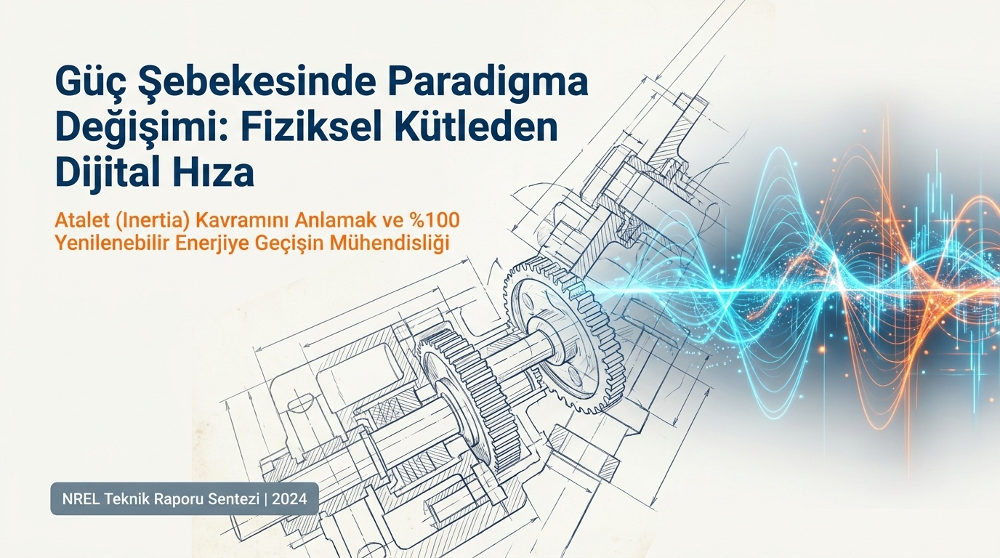
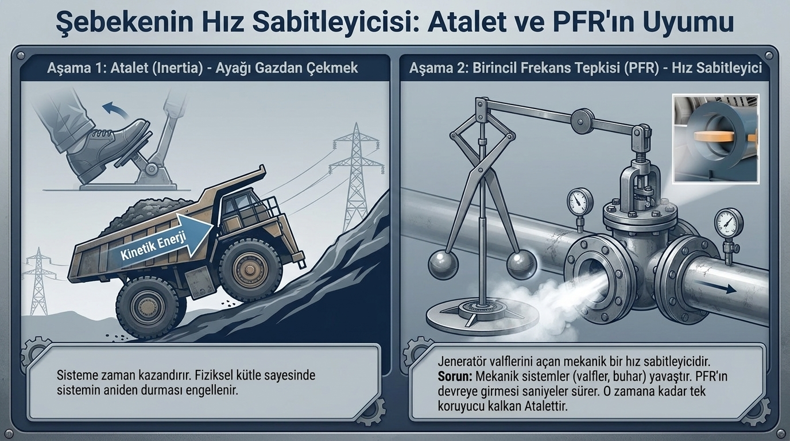
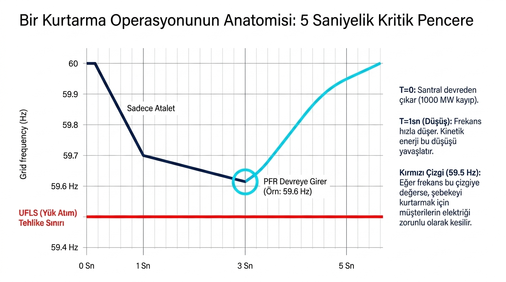
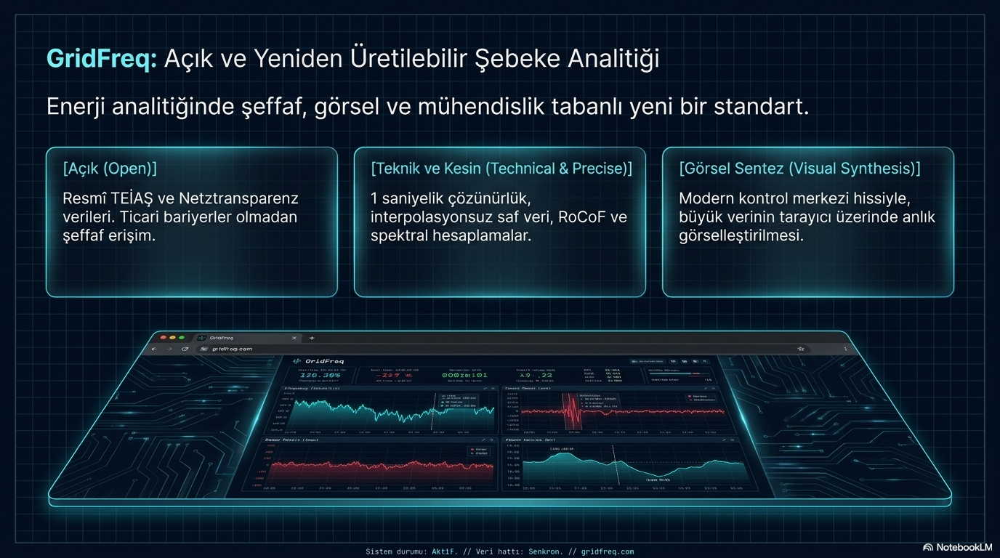

# Kütleden Dijital Hıza: Yeni Nesil Frekans Tepkisi Neden Daha Çevik?

**Alt başlık:** Doğal atalet, primer kontrol ve hızlı dijital desteğin zaman ölçekleri nasıl ayrışır?

Bir frekans olayında kullanılan her destek aynı işi ve aynı hızda yapmaz. Doğal senkron atalet, frekans değişimine fiziksel olarak anında karşı koyar; governor/PFR ve klasik PFK/FCR aktif güç açığını denetimle azaltır; batarya FFR ve diğer inverter tabanlı hizmetler ise uygun koşullarda daha kısa denetim gecikmeleriyle destek verebilir. Güvenli tasarım, bu tepkileri “eski ve yeni” diye değil, zaman ölçeği, güç sınırı ve enerji sürdürülebilirliği üzerinden karşılaştırır.

> **Ana mesaj:** Hızlı destek değerlidir; ancak frekans güvenliği için güç, enerji, ölçüm kalitesi ve olay sonrası toparlanma birlikte tasarlanmalıdır.

## İlk birkaç saniye neden kritik olabilir?

Büyük güç dengesizliğinde ilk RoCoF, frekansın güvenlik eşiklerine ne kadar hızlı yaklaştığını gösterir. Düşük atalet, büyük kayıp veya yetersiz ilk rezerv bu marjı daraltabilir. İlk birkaç saniye bu nedenle önemli olabilir; ancak evrensel bir “beş saniye kuralı” yoktur. Kritik zaman penceresi, olay büyüklüğüne, toplam kinetik enerjiye, yük sönümlemesine, koruma eşiğine ve kullanılabilir kontrol teknolojisine göre değişir.

Doğal atalet yeni aktif güç üretmez. Senkron makinelerin rotorlarındaki enerji kısa süreli açığı karşılayarak ilk frekans değişimini yavaşlatır. Bu fiziksel tepki, denetleyici ölçüm, karar veya haberleşme beklemez; buna karşılık etkisi rotor enerjisi ve sistem bileşimiyle sınırlıdır. Ataletin ardından etkinleşen kontrol katmanları, gücü bilinçli biçimde değiştirerek frekans sapmasının büyümesini durdurur ve daha sonra nominale dönüşe katkı sağlar.

## Governor/PFR ile klasik PFK/FCR’nin görevi

Governor ya da türbin denetimi, ölçülen frekans sapmasına göre mekanik gücü değiştirir. Primary Frequency Response - PFR (birincil frekans tepkisi) ve PFK/FCR kavramları farklı piyasa ve sistem çerçevelerinde değişen ayrıntılar taşısa da ortak işlev, frekans sapmasına karşı yerel ve otomatik aktif güç sağlamaktır. Başlangıçları ölçüm, ölü bant, kontrol kazancı, valf/türbin dinamiği ve hizmet gerekliliklerinden etkilenir.

Bu tepkilerin MW sınırı kullanılabilir rezervle, sürdürülebilirliği ise yakıt/su/termik kısıtlar ve işletme marjıyla ilgilidir. Doğal ataletin aksine denetimden kaynaklanırlar; bu yüzden ayarları, doygunlukları ve gecikmeleri incelenebilir. Primer kontrolün tek başına her zaman 50 Hz’e tam dönüş görevi olmadığı, frekans restorasyon katmanının farklı sorumluluk taşıdığı unutulmamalıdır.

## Batarya FFR ve inverter tabanlı hızlı destek

Batarya FFR, frekans veya RoCoF eşiğine göre aktif gücü çok kısa sürede değiştirebilir. Başlangıç hızı; ölçüm filtresi, denetim algoritması, inverter akım limiti ve varsa haberleşme yoluna bağlıdır. Sağlanabilecek MW, inverter ve batarya güç kapasitesiyle; ne kadar sürdürüleceği MWh, SOC ve termal sınırlarla belirlenir. FFR’nin güçlü başlangıç rampası, uzun süreli rezervin yerine geçtiği anlamına gelmez.

İnverter tabanlı hızlı destek farklı denetimlerle sağlanabilir. Şebeke takip eden kaynaklar mevcut referansa göre güç değiştirirken, şebeke oluşturan denetim gerilim/frekans referansına daha etkin katkı verebilir. Her iki durumda da hizmetin güvenliği, akım limitleri, gerilim koşulları, enerji kaynağı ve diğer kontrol katmanlarıyla koordinasyon tarafından belirlenir.

## Hızlı tepki neden her zaman daha iyi tepki değildir?

Çok agresif denetim, measurement noise (ölçüm gürültüsü) karşısında yanlış tetikleme yapabilir. Gereksiz ve sık güç değişimi batarya enerjisini tüketir, çevrim yaşlanmasını artırır veya inverteri akım limitine taşır. Birden fazla hızlı denetleyicinin benzer sinyale aynı anda yüksek kazançla yanıt vermesi, aşım ve oscillatory response (salınımlı tepki) riski oluşturabilir. Bu nedenle filtre, ölü bant, rampa, doygunluk ve çıkış stratejisi birlikte ayarlanmalıdır.

Hızın olay sonrası da maliyeti vardır. Batarya olayda verdiği enerjiyi SOC hedefi için geri alırsa veya FFR gücü aniden geri çekilirse rebound etkisi oluşabilir. Toparlanma, sistemde yeterli yavaş rezerv devreye girdikten sonra ve uygun rampayla yapılmalıdır. Hızlı destek böylece bağımsız bir darbe değil, daha uzun kontrol zincirinin koordine edilmiş ilk parçası olur.

## GridFreq ile zaman ölçeğini okumak

GridFreq, frekans eğrisindeki ilk eğim, nadir, geçici plato ve toparlanma bölgelerini karşılaştırmayı kolaylaştırır. Bu görünüm, destek türlerinin aday etkilerini incelemek için başlangıç sağlar; tek başına hangi teknolojinin ne kadar güç verdiğini veya denetim parametresini ispatlamaz. Kesin değerlendirme için birim telemetrisi, güç komutları, SOC kayıtları ve olay işletme kayıtları gerekir.

Kütleden dijital hıza geçişin doğru yorumu, mekanik ataletin değersizleşmesi değildir. Fiziksel tampon ile hızlı denetimin, güç ve enerji sınırlarını saklamadan, koruma ve restorasyon katmanlarıyla uyum içinde çalışmasıdır.

## Tepki biçimini seçerken sorulacak sorular

Bir hizmet tasarlanırken önce hangi bozuntuya karşı destek verileceği tanımlanmalıdır: ani üretim kaybı, aşırı frekans, ada işletimi veya gerilim-frekans bileşik olayı aynı tepkiyi istemez. Ardından tetikleyici, ölçüm penceresi, izin verilen MW, enerji süresi, rampa ve geri çekilme davranışı açıkça belirlenir. Bu sorular yanıtlanmadan yalnızca “daha hızlı” bir denetleyici seçmek, sistem düzeyinde daha iyi sonuç garanti etmez.

Doğal atalet, governor/PFR, klasik PFK/FCR ve dijital hızlı destek farklı zaman ölçeklerinde tamamlayıcıdır. Birinin sınırı diğerinin zorunlu olarak kusuru değildir: fiziksel atalet başlangıç eğimini sınırlar, aktif güç denetimi açığı azaltır, restorasyon rezervi ise kaynakları yeniden hazır hâle getirir. Mühendislik değeri, bu rollerin olay boyunca kesintisiz ve koordineli biçimde devredilmesinden doğar.
